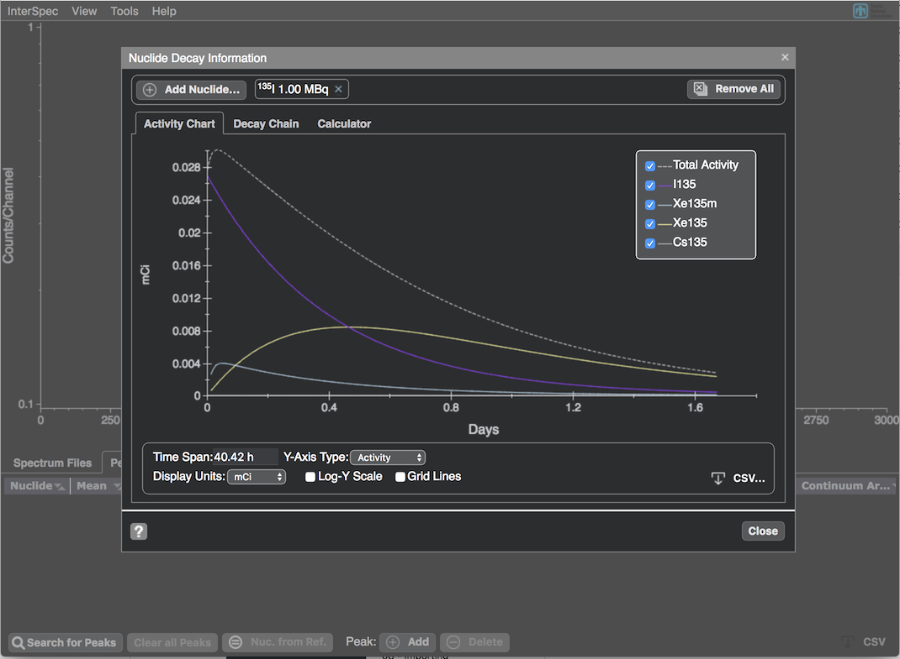
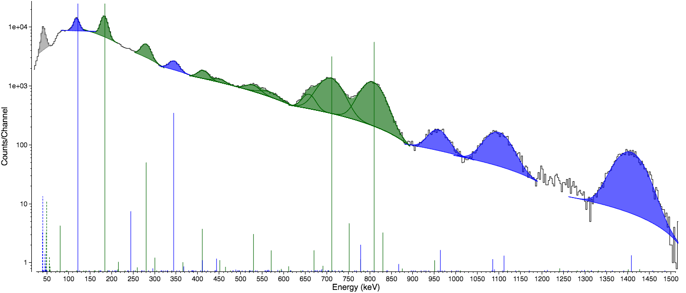

# InterSpec

- [Code and introductory page](https://github.com/sandialabs/InterSpec): [https://github.com/sandialabs/InterSpec](https://github.com/sandialabs/InterSpec)
- [Latest Release](http://github.com/sandialabs/InterSpec/releases/latest): [http://github.com/sandialabs/InterSpec/releases/latest](http://github.com/sandialabs/InterSpec/releases/latest)
  - Or for mobile:   
- [Release Notes, including short usage videos](https://sandialabs.github.io/InterSpec/releases/): [https://sandialabs.github.io/InterSpec/releases/](https://sandialabs.github.io/InterSpec/releases/)
- [Tutorials and example problems/solutions](https://sandialabs.github.io/InterSpec/tutorials/): [https://sandialabs.github.io/InterSpec/tutorials/](https://sandialabs.github.io/InterSpec/tutorials/)

Some example screenshots:

<!---  -->

Apple and the Apple logo are trademarks of Apple Inc., registered in the U.S. and other countries and regions. App Store is a service mark of Apple Inc.
Google Play and the Google Play logo are trademarks of Google LLC.
