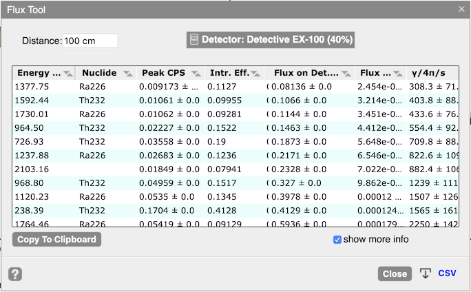
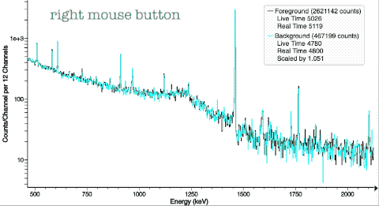
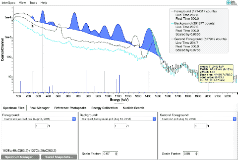
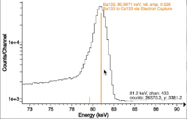
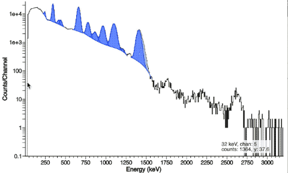
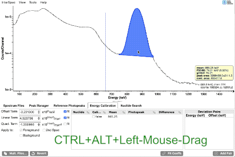

## v1.0.5 (August 23, 2019)
This release is mostly small bug fixes, improvements, and the addition of the "Flux Tool".

* Bug Fixes and improvements:
  - A concurrency issue that could lead to the File Query Tool very rarely missing results for Windows/Linux was fixed.
  - For Windows, fixed issue where when opening a spectrum file by dragging it to `InterSpec`s icon in Windows Explorer, the file wouldnt always be opened 
  - The macOS version of InterSpec is now sandboxed, has the hardened runtime enabled, and notarized by Apple.  Unfortunately this required a one-time change that if you would like to keep your previous settings and worked saved in `InterSpec`s internal database, please see [these instructions](v1.0.5/macOS_upgrade_notes).
  - Some small improvements to plotting the spectra, including the background spectrum line is now plotted behind the foreground spectrum line.
  - Other small fixes and improvements.

* Feature addition:
  - Added a "Flux Tool" that helps you to compute the number of gammas at a given energy produced by a source, either per unit area per second, or into 4&pi; steradians per second.  The tool uses the fit peak areas, an entered distance, and the detector response function to take into account geometrical and detection efficiencies.  More detailed information can be found in [flux_tool_help.pdf](v1.0.5/flux_tool_help.pdf) (also available inside `InterSpec`s built in help system).

  

## v1.0.4 (July 21, 2019)
This release primarily improves the interactivity with the spectrum.
Download Windows, Linux, and macOS binaries from: [https://github.com/sandialabs/InterSpec/releases/tag/v1.0.4](https://github.com/sandialabs/InterSpec/releases/tag/v1.0.4)

* Bug fixes:
  * InterSpec would not start for Windows users with some non-English characters (ex, an umlaut) in their user names.  Paths with these letters also affected the file query tool, or if the open file menu item was used to open spectrum file.
  * The "Add Peak" option when a Region of Interest (ROI) is right clicked had issue resulting in peaks not actually being added
  * Windows and Linux version of app could sometimes get duplicate menu items

* New Features:
  * Based on the awesome work by [Christian Morte](https://github.com/kenmorte) of using [D3.js](https://d3js.org/) to plot spectrum files, the plotting and interacting with spectra has been completely re-written, and made substantially better.  See below videos for an overview of how to interact with the spectrum.
    * This new charting mechanism will make it easier to implement richer, more interactive features in the future.
    * On touch-devices, some touch interactions are working, but there is no timeline for when the rest will be implemented, so for now phone and tablet versions of the app will use the old charting mechanism
    * There are significant additional performance improvements and user experience improvements possible, but there is no timeline for this work
  * Added some example problems and solutions available at [https://sandialabs.github.io/InterSpec/tutorials/](https://sandialabs.github.io/InterSpec/tutorials/)
  * Added a few new file formats (TKA, MultiAct), and some new N42 format variants
  * A number of smaller bug fixes and improvements

### Interactions with the spectra:
  All these videos are also available within `InterSpec` by going to the **Help** &rarr; **Welcome...** menu item, and then selecting the **Controls** tab.

  * Zoom In and Zoom Out
    
    * Left-click and drag to the right to zoom in, and left-click and drag to the left to zoom out (same as before).
    * Or use the energy slider chart (see below)

  * Drag The Spectrum Left and Right
    
    * Use the right mouse button to grab and drag the spectrum left and right.
    * You can also use the vertical scroll-wheel (if your mouse or trackpad supports this) to move the chart left and right.
    * You can also "grab" the x-axis using the left mouse button to drag it left and right.
    * Or use the energy slider chart (see below)

  * _**New**_ Energy Slider Chart:
    
    * Select the **View** &rarr; **Chart Options** &rarr; **Show Energy Slider** menu item to enable the slider chart.  Whether this chart is shown or not is remembered by `InterSpec` in future sessions.

  * _**New**_ Graphically Scale Background and Secondary Spectra
    
    * Select the **View** &rarr; **Chart Options** &rarr; **Show Y-Axis Scalers** menu option to enable the scalers on the right side of the chart.  Scalers are only shown for the background and secondary spectra, and only when they are plotted (eg, if you are only displaying a foreground spectrum, no sliders will be shown).  The **Spectrum Files** tab has a button to re-Live-Time normalize the spectra (which `InterSpec` does by default) if you wish.  Whether these scalers are shown or not is remembered by `InterSpec` in future sessions.

  * _**New**_ Graphically Adjust Peak Fit Range
    
    * Move your mouse to within 10 pixels of the edge of a ROI, and the cursor will change indicating you can left-click and drag the ROI edge to where you would like.  Your mouse must also be approximately within the Y-axis range of the peak as well (this is so when you have HPGe spectra with many peaks, you wont accidentally grab a ROI edge when zooming in and out).
    * Dragging one side of a ROI past the other side of a ROI will delete the ROI.
    * You can also adjust the ROI range (and everything else about the peak) using the **Peak Editor** that can be gotten to by right-clicking on a peak

  * Fitting for Peaks
    
    * Same as before.  The easiest way to fit a peak is to just double click in the vicinity of the peak region.  If you want to add another peak nearby, just double click again.  You can also right-click on a peak and select to add a peak in the same region of interest (ROI).

  * Fit for Multiple Peaks in a ROI at Once
    
    * <kbd>CTRL</kbd> + Left-Click-and-Drag.  When you release the mouse a menu will pop up and allow you to select how many peaks you would like in the ROI.

  * _**New**_ Adjust Axis Ranges by Dragging On Axis
    
    * You can change the axis ranges by clicking and dragging the ticks.
    * The y-axis also responds to the mouse wheel, which lets you adjust the padding both on the top, and the bottom of the y-axis

  * _**Improved**_  Graphical Energy Calibration
    
    * <kbd>CTRL</kbd> + <kbd>ALT</kbd> + Left-Click-Drag
      * If you do this twice in a row, like first on a low energy peak, then a high energy peak (or vice versa), the dialog that pops up will have an option that will make it so both of your calibrations points will be preserved by adjusting both the gain and offset.

  * See the **Controls** tab of the **Welcome** screen in `InterSpec` for more.

