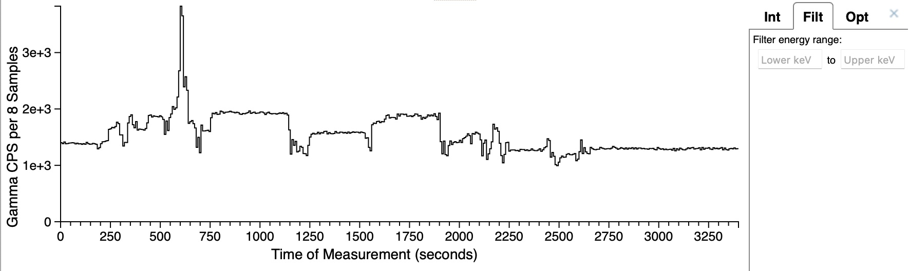

SAND2023-05961O

# InterSpec v1.0.12 release notes (May 2024)

InterSpec v1.0.12 adds a number of new features and improvements, as well as fixes many bugs.
 
The largest new features are undo/redo support, new peak skew models, and a flexible spectrum file export tool.
 
 
Most features added were user requested, and a large amount of the bugs fixed were user reported - so 
please keep reporting issues and requesting improvements or information to InterSpec@sandia.gov.

SAND2024-05524O.

### New features and capabilities
- Undo/redo support for many operations throughout the app.
    - You can use ctrl-z/ctrl-shift-z (macOS: ⌘-z/⌘-shift-z), or undo/redo under the "Edit" menu
    - E.g., if you modify a peaks range of interest (ROI), and don't like the result, simply hit ctrl-z.  Or if you zoom-out on the spectrum, but didn't want to, just hit ctrl-z. If you close a tool, but didn't mean to, hit ctrl-z. etc.
    - Works for most general operations throughout the app, but there are some tools this functionality is not implemented for: "Isotopes by nuclides", "File Query Tool", "Color Themes...", "File Parameters", "Math/Command Terminal", "Make Detector Response", "Spectrum Manager", "Maps", and possibly a few other smaller dialogs/places.
    - Because this support has been added on "after the fact", we may not have everything 100% correct yet; if any unexpected behavior is encountered, please send an email to InterSpec@sandia.gov with instructions on how to reproduce.
    - The undo/redo is implemented so that you don't lose any of your steps, even if you undo a number of times, then make other changes, if you then undo again, the undoes will cycle through the initial steps that you undid as well.

- Added five new peak skew models, and removed the previous (not-working) Landau Skew.
  - You can select/change a peak skew model by 
    - right-clicking on a peak, and use the "Change Skew Type" sub-menu, or
    - Using the "Peak Editor", where you can also have more control over the skew parameters.
    <table style="border: 1px solid black; border-collapse: collapse; width:60%; margin-left: auto; margin-right: auto;">
      <tr>
        <td style="border: 1px solid black; padding-top: 2px; padding-bottom: 2px; width:50%">
          
          
Example of using a right-click to change the skew type.

        </td>
        <td style="border: 1px solid black; padding-top: 2px; padding-bottom: 2px; width:50%">
          
          
The skew-related options in the Peak Editor

        </td>
      </tr>
    </table>
  - Currently, if you set a peak to use a skew, other peaks you then fit in that ROI will also have that same skew model, but peaks outside that ROI will not pickup that skew model preference.
  - "Isotopics by nuclides", and a few other places throughout the app will also let you pick a skew model
  - The five added peak's skews are, with an example fit for each, using the same energy range for a CZT detectors peak:
  <table style="border: 1px solid black; border-collapse: collapse; width:100%">
    <tr>
      <td style="border: 1px solid black; padding-top: 2px; padding-bottom: 2px; width:40%">
        
      </td>
      <td style="border: 1px solid black; padding-top: 2px; padding-bottom: 2px;">
        
No Skew

      </td>
    </tr>
    <tr>
      <td style="border: 1px solid black; padding-top: 2px; padding-bottom: 2px; width:40%">
        
      </td>
      <td style="border: 1px solid black; padding-top: 2px; padding-bottom: 2px;">
        <b>Exp*Gauss</b>: Convolution of Gaussian with a left-hand exponential multiplied by a
        step function that goes to zero above the peak mean.
         
        See:
        

          &nbsp;&nbsp;&nbsp;&nbsp;Analytical function for fitting peaks in alpha-particle spectra from Si detectors 
          &nbsp;&nbsp;&nbsp;&nbsp;International Journal of Radiation Applications and Instrumentation. Part A. Applied Radiation and Isotopes 
          &nbsp;&nbsp;&nbsp;&nbsp;Volume 38, Issue 10, 1987, Pages 831-837 
          &nbsp;&nbsp;&nbsp;&nbsp;<a href="https://doi.org/10.1016/0883-2889(87)90180-8" target="_blank">https://doi.org/10.1016/0883-2889(87)90180-8</a>
        

        

          Although in the paper two exponentials are used, for gamma-spectroscopy a single exponential
          appears to usually be sufficient, so <em>InterSpec</em> only implements a single exponential.
        

      </td>
    </tr>
    <tr>
      <td style="border: 1px solid black; padding-top: 2px; padding-bottom: 2px; width:40%">
        
      </td>
      <td style="border: 1px solid black; padding-top: 2px; padding-bottom: 2px;">
        <b>GaussExp</b>: An exponential tail stitched to a Gaussian core.
         
        See:
        

          &nbsp;&nbsp;&nbsp;&nbsp;A simple alternative to the Crystal Ball function. 
          &nbsp;&nbsp;&nbsp;&nbsp;Souvik Das, arXiv:1603.08591 
          &nbsp;&nbsp;&nbsp;&nbsp;<a href="https://arxiv.org/abs/1603.08591" target="_blank">https://arxiv.org/abs/1603.08591</a>
        

      </td>
    </tr>
    <tr>
      <td style="border: 1px solid black; padding-top: 2px; padding-bottom: 2px; width:40%">
        
      </td>
      <td style="border: 1px solid black; padding-top: 2px; padding-bottom: 2px;">
        <b>Crystal Ball</b>: A Gaussian core portion and a power-law low-end tail, below a threshold.
         
        See:
        

          &nbsp;&nbsp;&nbsp;&nbsp;<a href="https://en.wikipedia.org/wiki/Crystal_Ball_function" target="_blank">https://en.wikipedia.org/wiki/Crystal_Ball_function</a> 
        

        

          Uses two skew parameters.
          <ol>
            <li><b>&alpha;</b>: defines the threshold (how many gaussian sigma away from the mean for the modified-tail to start).</li>
            <li><b>n</b>: defines the power-law.</li>
          </ol>
        

      </td>
    </tr>
    <tr>
      <td style="border: 1px solid black; padding-top: 2px; padding-bottom: 2px; width:40%">
        
      </td>
      <td style="border: 1px solid black; padding-top: 2px; padding-bottom: 2px;">
        <b>ExpGaussExp</b>: A double-sided version of the <em>GaussExp</em> distribution, with separate parameters for the lower and upper tails.
      </td>
    </tr>
    <tr>
      <td style="border: 1px solid black; padding-top: 2px; padding-bottom: 2px; width:40%">
        
      </td>
      <td style="border: 1px solid black; padding-top: 2px; padding-bottom: 2px;">
        <b>Double Sided Crystal Ball</b>: A double-sided version of the <em>Crystal Ball</em> distribution, with separate <b>&alpha;</b> and <b>n</b> for the lower and upper tails.
      </td>
    </tr>
  </table>

- Add accounting for nuclide decay during the measurement, for both the "Activity/Shielding fit" and "Isotopics from peaks" tools.
  For Activity/Shielding fit, this option is not checked by default, but for the "Isotopics from peaks", if the measurement dwell time is greater than 0.5% of the parent nuclide half-life, then this option will be checked by default.
  - This correction takes into account progeny ingrowth, decay, and subsequent changes in branching ratios, so some minor slow down of the answer computation may be observed because of these more involved calculations.
  - The "Activity/Shielding Fit" tool log provides approximate values of how much this correction effected the activity answers.
  <table style="border: 1px solid black; border-collapse: collapse; width:95%; margin-left: auto; margin-right: auto;">
    <tr>
      <td style="border: 1px solid black; padding-top: 2px; padding-bottom: 2px; width:30%;">
        
        
This option in the Activity/Shielding fit tool.

    </td>
    <td style="border: 1px solid black; padding-top: 2px; padding-bottom: 2px;">
      
      
This option in the "Isotopics from peaks" tool; it can be controlled for each nuclide individually.

    </td>
  </tr>
  </table>

- Added a "FAQs" to the in-app documentation.  These are some of the questions users have asked, or we have observed causing confusion.
    See "Help" &rarr; "Welcome..." &rarr; "FAQs", or if you have already downloaded and run v1.0.12, you can click [here](interspec://welcome?topic=faqs) to open this tool.

- Add a spectrum file export dialog.
  This dialog allows you to choose the format to save the spectrum to, as well as how and what is written to the file.  Options that become available depend on the currently loaded and/or displayed data, as well as the spectrum file format being saved to.  This dialog hopefully contains all the options one might want, but if anything is missed, please send an email to InterSpec@sandia.gov.  If you hover the mouse over any of the options, a tooltip will appear with additional explanation.

- Updated support for accepting and creating QR-codes that contain a spectrum.  
  - Some options were added to allow creating a QR-code that generates an email, with a URI as its content
  - The specification has been updated in [spectrum_in_a_qr_code_uur_latest.pdf](https://sandialabs.github.io/InterSpec/tutorials/references/spectrum_in_a_qr_code_uur_latest.pdf), and a overview of using QR-codes to represent spectra is available at [20230829_spectra_in_a_QR-code_SAND2023-08778O.pdf](https://sandialabs.github.io/InterSpec/tutorials/references/20230829_spectra_in_a_QR-code_SAND2023-08778O.pdf).
  - If you drag-n-drop an image file (JPEG, PNG, SVG, BMP) that contains a QR-code onto InterSpec, you will be presented with a dialog showing the image, and it will be searched for QR-codes, and if a spectrum QR-code is found, you will be presented an option to open it like a normal spectrum file.
  - QR-codes containing spectra can be created using the spectrum file export tool:
  <table style="border: 1px solid black; border-collapse: collapse; width:95%; margin-left: auto; margin-right: auto;">
    <tr>
      <td style="border: 1px solid black; padding-top: 2px; padding-bottom: 2px; width:50%">
        
        
The file-format to choose in the export dialog to create a QR-code.

    </td>
    <td style="border: 1px solid black; padding-top: 2px; padding-bottom: 2px;">
      
      

        The resulting QR-code representing the spectrum.  
        Note that you can also copy the URI to the pasteboard, download an SVG, 
        or instead create a QR-code that will create an email with the URI in the email body.
      

    </td>
  </tr>
  </table>

- Add efficiency functions for some additional detectors.
  - Detectors added: Radiacode 102, Fulcrum40h, identiFINDER-R300, identiFINDER-R425, IdentiFINDER-R500-NaI, Radseeker-LaBr3, RadSeeker-NaI, BNC Sam-935, BNC Sam-940 1.5x1.5 LaBr, BNC Sam-940 3x3 NaI, BNC Sam-945, BNC SAM-950 3x3 NaI, Verifinder, ORTEC RadEagle, Mirion SPIR-Ace, CZT 1cm-1cm-1cm, CZT 1.5cm-2cm-2cm, NaI 2x4x16
  - The efficiency functions for some, but not all, of these models will be automatically loaded when a spectrum file from the detector is loaded.  You can over-ride this by selecting a different efficiency function to be used by default for a particular model.  
  - If a efficiency function is not loaded for your detector, you can click on the detector icon in various places throughout the app, then select the "Rel. Eff." tab on the resulting dialog, and then select your efficiency function.

- Added capability to measure distances on the Map tool.  Select the  icon on lower left of the Map tool to use this functionality.

- Added a capability for users to define their own Reference Lines.
    - Users can add a file, `add_ref_lines.xml` to their data directory (See "About InterSpec" &rarr; "Data" &rarr; user data directory, usually "<code>C:\\Users\\&lt;username&gt;\\AppData\\Roaming\\InterSpec\\</code>"), that defines additional lines.
    - A `add_ref_lines.xml` file that contains documentation on how to define custom sources is distributed in the `data` directory of InterSpec, and can also be seen [here](https://github.com/sandialabs/InterSpec/blob/master/data/add_ref_line.xml).
        - This file currently defines "HPGe(n,n)" (the "ski-slopes" seen on HPGe detectors from fast neutrons), "Pu low burnup", "Pu high burnup", "Pu heat source", "U depleted", "U natural", "U 3% enriched", and "U 93.3% enriched".  Typing these values into the "nuclide" field of the "Reference Photopeak" tab will show the respective lines.

- Add option to add peaks from "Isotopics from nuclides" tool to the foreground spectrum.  This can be particularly useful for HPGe spectra with lots of peaks (e.g., Plutonium,  Eu152, etc).  This option can be accessed from the three-dot menu in the upper-right of the tool.

- Improve spectrum file opening speed for large spectrum files on macOS, when you drag-n-drop the spectrum file onto InterSpec, by avoiding an intermediate slow file copy.  
    - However, currently on Windows, the "WebView2" version of InterSpec still suffers from this intermediate slow file copy, so opening large spectrum files can be quite slow.  If you commonly open large spectrum files (larger than maybe a megabyte), consider using the "Electron" version of InterSpec which also bypasses this slow intermediate copy.

- User peak-labels are now shown by default.
- In the auto peak search result dialog, the peak in question for each row is now accentuated, relative to any other visible peaks.  See [Issue 27](https://github.com/sandialabs/InterSpec/issues/27)
- If a reference photopeak line has multiple contributing gammas (all at the same energy), when you mouse over the reference line, the percentage contribution from each source is now shown.
- Add option to display the y-axis as log for gammas on the time chart. See [Issue 26](https://github.com/sandialabs/InterSpec/issues/26).

- Added a "External RID" capability.
  This tool, available in the "Tools" menu, allows interfacing with the [https://full-spectrum.sandia.gov](https://full-spectrum.sandia.gov) service to perform automated nuclide ID on spectra.  This service is powered by the GADRAS Full Spectrum Isotope ID algorithm to provide an automated nuclide ID capability.
  However, because it is a web-service that causes data/information to leave your computer, it is <b>not</b> enabled by default, and to use it, you must manually enter the <code>https://full-spectrum.sandia.gov/api/v1</code> URL into the tool; see figure of the tool below.
  

    
    
Overview of the External RID tool, where the <code>https://full-spectrum.sandia.gov/api/v1</code> URL has been entered, and it has been
    selected to always call this service upon spectrum load, in which case RID results will be shown as a "Toast" message.  
    If the "Show dialog" option is selected instead, a dialog with the results will instead always be shown.
    

  

  
  - If you do enable this capability, then there is an option to have InterSpec call out to this service any time you load a spectrum, in which case you will be notified of the results, and the "Reference Photopeak" tab will show the results, so you can easily click on the nuclide, and verify the ID.  If you do not enable this option, then you will need to explicitly go to this tool to get RID results.
  
  - To be clear, unless you manually enter this URL and enable this service, InterSpec never sends radiation data from your computer.  
    If you do enable this service, you will be warned before using this tool, and you can always disable it. 
    The only other time InterSpec will make any external network (i.e., internet) requests, or receive external information, is for the Map tool, to request map tiles, in which case no radiation data leaves your computer, and there is an option to use your own <a href="https://arcgis.com">https://arcgis.com</a> account.  
    Sandia National Laboratories does not collect any telemetry, usage stats, etc. from InterSpec, and these two tools ("External RID" and "Map") are the only features in InterSpec that cause information to be requested or transmitted external to your computer.  Before sending radiation data to the service, information like GPS coordinates, serial numbers, embedded images, and similar information are removed, and measurement start times have a random offset between plus or minus 1 year added to them.
  
  - There is also a "<em>Executable</em>" option for this tool, that is intended to be used with a local version of the full-spectrum tool, or another similar tool.  However, we do not currently distribute the full-spectrum executable.
  
  - The help page for this tool gives a brief overview of the data format used for transmitting and receiving data to the <a href="https://full-spectrum.sandia.gov">https://full-spectrum.sandia.gov</a> service, or local executable.  If you are interested in using the REST service from another application from your scripts or application, please email <a href="InterSpec@sandia.gov">InterSpec@sandia.gov</a> for more complete information.

- Added representing detector efficiencies as "fixed-geometries" -  e.g., activity per cm2, per m2, and per gram as options.  
  Normally InterSpec treats detector efficiencies as "far-field" efficiencies that can be corrected for the current measurement distances.
  However, fixed-geometry efficiencies are for configurations where allowing different distances doesn't make sense.  For example, an infinite plane, or an extended source whose extents are comparable to the distance to the detector.  So when using a fixed-geometry efficiency function, the option to input a distance will disappear, and answers will be quoted in the units intended by the efficiency function.

- Added accepting ".ECC" files, produced by the ISOCS program, to use as a detector efficiency.  To import a .ECC file into InterSpec, just drag-n-drop the file onto InterSpec.
  When loading the ".ECC" efficiency function, you will be prompted if the efficiency should be treated as a far-field response, or a fixed geometry.

- Added some "deep-linking" capabilities throughout the app.  
  This is to allow recording individual tool states to either use later, or to provide to others.
  When you run InterSpec for the first time, URIs starting with "interspec://" and "raddata://" are associated with InterSpec to your operating system.  So after that, if you click on a URL in your web browser or other application, or ask your operating system to open one of these URIs, it will pass the URI off to InterSpec.
  In some places throughout InterSpec you will see a QR-code icon in the lower left-hand of the tool, clicking this will cause a QR-code with the URI representing the current state to be generated, and there will also be an option to copy the URI to your pasteboard. 
  - You can also copy/paste URIs into InterSpec by using the "Enter URL" tool available in the "Edit" menu.
  - Some example URIs:
    - [Calculating dose for Ba133](interspec://dose/dose%3fVER%3d1%26NUC%3dBa133%26ACT%3d10%26ACTINUNIT%3d%ce%bcCi%26ACTOUTUNIT%3dbecquerels%26DOSE%3d100%26DOSEINUNIT%3d%ce%bcR%2fhr%26DOSEOUTUNIT%3drem%2fhr%26DIST%3d100%20cm)
    - [A 1/r2 calculation](interspec://1overr2/?V%3d1%26NEAR%3d0.00%26FAR%3d0.00%26BACK%3d0.00%26DIST%3d0.00%26POW%3d2)
  - The full list of tools that can be passed one of these deep links can be found in the [InterSpec::handleAppUrl function](https://github.com/sandialabs/InterSpec/blob/4bfd0d518bf769fd7a7bf9d3fa683cad223a882b/src/InterSpec.cpp#L11150C1-L11150C67).

- Improved some detection-system specific data loading.  Notable changes include:
  - For Symetrica Verifinder detectors, now filters out calibration and stabilization measurements when the user selects "raw" or "derived" data, when loading the file.
  - For RSI systems that contain "Virtual Detectors" (e.g., "VD1", "VD2N", etc), add in check for multiple "VD..." detectors on file load, and give users choice of selecting them.  These VD detectors may represent similar data, sums of other VD detectors, or other unknown configurations, so now the user will be prompted to choose what they want, since there is no way to automatically determine what the data represents.
  - A number of various other spectrum file parsing improvements have been made.
- Added a "Relative Efficiency" type chart to the &quot;<em>Search for Peaks</em>&quot; results dialog if nuclide reference photopeaks were being shown before searching for peaks.  
  This chart can help detect correct assigning of nuclides to peaks, or presence of other interfering sources since the displayed data points are 
  expected to form a smooth distribution (within statistics).  An example good distribution is:
  

    
    

      An example peak search results for the included example <code>Ba133</code> spectrum.  To get this result, <code>Ba133</code> reference photopeak
      lines where showing, and the &quot;<em>Search for Peaks</em>&quot; button on the &quot;<em>Peak Manager</em>&quot; tab was clicked.  
      The &quot;<em>Relative Efficiency Plot</em>&quot; was also expanded to be visible.
    

  

  - Using the &quot;<em>Isotopics from peaks</em>&quot; tool is a more powerful way to detect incorrect assignments, or interfering nuclides being present.

- Improved the Relative Efficiency chart for the "Isotopics from peaks" tool.
  - Made chart layout more dynamic for resizes
  - Changed it so the markers on the chart are the same color as dominant nuclide for that data point. Now if a nuclide is over 50% of a data point, the marker will get that nuclides color (i.e., the same as that nuclides peaks), or if there are multiple nuclides, but none over 50%, then the marker will be colored the same color as the background spectrum line.

- On nuclide search tab, added option to assign all peaks near reference photopeak lines, or just peaks without a nuclide assigned, to the currently selected search-nuclide.
  This is convenient if you tend to fit peaks before identifying their source nuclides, but would like to assign the source nuclides once you find a positive ID.
  

    
    

      Example of how to assign all current peaks near the currently selected nuclide on the &quot;<em>Nuclide Search</em>&quot; tab, to that nuclide.
    

  

- Added some more fields to the peak CSV export: peak skew type, continuum coefficients, and skew coefficients.  Also added in reading amplitude uncertainty.
  If you export a CSV file from the "Peak Manager" tab, you can later drag-n-drop that CSV file onto InterSpec to fit those same peaks in a different spectrum file.

- Added writing peaks to SPE (IAEA) spectrum files.
  This is done by adding a "$PEAK_INFO_CSV:" to the file, under which the peak CSV information is written.

- Add option to fix a peaks mean to the currently showing reference photopeak line, by right-clicking on the peak, and selecting the "Fix to X keV" option, where "X" is the reference photopeak line energy.  This can be useful for low-statistics peaks, or peaks that overlap with another larger peak.

- Added option when you right-click on a peak, to fix the peak to the current detector resolutions FWHM.  If there is no current detector resolution available (i.e., the current detector efficiency function does not include this information, or no detector efficiency function is loaded), a dialog will be shown that allows you to fit the FWHM, as a function of energy, from your current foreground spectrum.
  

    
    

      Example of right-clicking on a peak to use this feature.
    

  

  

    
    

      Dialog asking if you would like to fit FWHM from current spectrum, which will be shown if your currently selected detector doesn't have an associated FWHM functional form.
    

  

  

    
    

      Screenshot of the tool to fit the FWHM functional form, from current spectrum. 
      The tool uses both peaks you have already fit, as well as peaks that could be found doing an automatic peak search. 
      By default, outlier peaks are selected to not be used in the fit, but you can manually select whichever peaks you would like.  
      You can also select the functional form you would like fit, as well as manually modify coefficient values, if you would like.
    

  

  

    
    

      You can also access the tool to fit the FWHM function from the current data, via the detector selection tool.
    

  

- Improved dragging a peak's ROI by its edge, so that the threshold for changing the currently fit peak evolves as you drag the ROI edge (instead of previously always comparing the current fit to the original peak to decide which one to use), to allow the peak fit to improve as you change the ROI.

- Added allowing drag-n-drop of Activity/Shielding Fit XML config onto app.  From the Activity/Shielding fit tool, you can "Export Model" from the menu in the upper right-hand side, which will yield an XML file with the setup for the current fit.  If you drag-n-drop this XML file ont the app later, it will go to the Activity/Shielding fit tool and set it up the same way.  This is useful for complicated setups you may re-use multiple times. 

- If you now hover the mouse over the spectrum legend, the "Live Time" text will change to tell you the dead time percentage, as well as additional neutron details.

- Add support for energy calibration in radiacode spectrograms (thanks to @ckuethe)

- Add explicitly parsing neutron live time from spectrum files.  
  Previously for some spectrum files where the neutron information was parsed in the same record as the gamma information, it would be assumed the gamma real-time was the neutron live-time, which sometimes wasn't the case.  Additionally, when summing the records corresponding to a time period, neutron live-times wouldnt be tracked and the gamma real-time used instead, which could lead to the wrong CPS in some cases.  Now the neutron live-time is tracked separately from the gamma detectors, when the spectrum file provides this information, as well as for summing over records.
- Parsing of search-mode or portal data has slightly changed so that the ordering may/usually default to the order in the file, instead of being sorted by measurement start time.

- Various other smaller display, documentation, and UX improvements were made.

### Bug fixes
- Fix macOS Quick Look capability.  Spectrum file icons will now show previews of the files data, as will Finder gallery view, and similar.
- Fix error uploading spectrum files that had non-ISO-8859-1 code points in the filename.
- Work around apparent/possible issue in WebKit, where sometimes the second time you showed the "Make Detector Response" tool in a session, the WebView rendering process would crash, after allocating lots of memory (issue didnt happen in FireFox, and no reason why this happened could be found).
- Fix potential invalid JS reference, on first load if Time Chart is not yet visible.
- Fix the stub documentation for "Isotopics by nuclides" tool, to keep from messing the whole app up.
- Fix bug converting from metric length to SAE length.
- Fix quirk in updating energy range on new spectrum load.
- Fix some display issues on phones.
- Denote half-life as T1/2, hopefully throughout the app.
- Fix simple dialog ending up behind other dialogs on tablets.
- Fix bug causing crash on Windows where the SpecMeasManager::m_spectrumManagerWindow pointer was not initialized to `nullptr` (on other operating systems it *happened* to be set to `nullptr`).
- Fix using non-Uranium nuclides in "Isotopics from peaks" tool when a non-SandiaDecay data source is selected.
- Fix the automated-search peaks that are fit when you load a spectrum, but not displayed to the user, now get energy-translated when you change the energy calibrations.  These auto-search peaks that aren't shown to the user are used internally by InterSpec pretty much only to help provide nuclide ID suggestions.
- Fix the HTML export "Isotopics from Peaks" to now include the background spectrum as well.
- Fix bug setting nuclide age to default value when changing nuclides on Reference Photopeak tab.
- Fix "Isotopics from peaks" background subtraction routine. The background peak counts were being subtracted from the primary peak multiple times (once additional time for every peak higher in energy).
- Fix peak-editor not applying peak color change.
- Fix showing some dialogs when window is less than 1000px.
- Fix allowing use of annihilation gammas in the "Isotopics from peaks" tool.
- Change so if a peak's mean is fixed, then the peak cant be used to adjust energy calibration.
- Fix issue that if you loaded a application state from the internal database, and then subsequently changed foreground spectrum, and then back to the one from the DB state, your app state would no longer be connected to the database state (e.g., you couldnt update the original state in the database).
- Fix Search-Mode 3D chart not displaying full time span on longer files, and also the user not being able to change the displayed number of time and energy slices.  Also improved the layout of this tool a little.
- Improve spectrum file opening dialog to better indicate opening process.  This primarily effects the Windows WebView2 version of InterSpec, which still has a slow intermediate file copy step.
- Fix "log-y" scale for nuclide decay chart.
- Fix time inputs to allow a unit-less value of zero (i.e. "0").
- Fix reference lines with multiple gammas not showing a description when you mouse-over the ref line on the spectrum. Thanks to @furutaka for finding and reporting this issue.
- Fix links to open `http://` addresses in browser not working on macOS.  `http://` and `https://` links within InterSpec should open in your operating systems default web-browser.
- Fix macOS Edit menu not clearing on &quot;Clear Session...&quot;
- Fix issue where email-to spectrum URIs where having an option bit set into the URI, that should have.
- Fix issue where values like &quot;5 micro-gram&quot; could be interpreted as an activity.
- Fix detector efficiency percentage to be relative to a 3x3 NaI detector at 1332 keV, instead of 661 keV.
- Fix bug fitting for FWHM when making a DRF. The FWHM equation type and order was not being treated consistently.
- Fix some dialogs not being deleted when a &quot;Clear Session...&quot; was done. 
- Fix copy-paste of DRF coefficients on the &quot;Formula&quot; tab "Detector Response Tool".  If you have a mathematical detector efficiency function, that is of the form `exp( A + B*log(x) + C*log(x)^2, ... )`, you can just paste the A, B, C, ... coefficients into the input field, and they will be interpreted as being this function. 
- Fix/change spectrum file query widget to always use seconds for live/real times.  Some other fields in the CSV you can export have also been made a little spreadsheet friendly.
- Fix the energy calibration when a HTML report is exported from the "Isotopics by nuclide" tool, and the energy calibration adjust option had been selected.
- Fix issue de-serializing ShieldingSelect from XML; the areal density for generic shielding wasn't properly having the units divided out.
- Fix bug when you typed a photo peak energy directly into a table giving peak information, it would then cause the table display to get messed up.
- Fix android app crashing if opening file/URI without app already running.
- Fix incorrect times being shown in the popup on the Map tool.
- Fix fitting for mass-fractions in the Activity/Shielding Fit tool, and nuclide fractions being able to add up to more than 1.0, in GUI.
- Fix issue where after right-clicking on the spectrum or energy slider, the mouse being let-up was not correctly detected
- Fix and improve reading various vendor/model specific spectrum files 
- Fix so date/time parsing always uses the &quot;C&quot; locale, and not users current locale; on Linux parsing date/times was sometimes failing, particularly for dates that included English month names.
- Fix potential infinite recursion when using the energy strip chart.
- Fix to allow polynomial energy calibration offset coefficient up to 5 MeV, primarily for alpha particle spectra.

### Code-related changes
- Started work on allowing &quot;batch&quot; peak fitting, and activity/shielding fitting. 
  Eventually will hopefully support processing many similar spectra from the command line, using a "exemplar" file.  
  That is, if you have many spectra that are similar, and you want to either fit peaks in them, or the activity of some nuclides, 
  you will just have to manually analyze one spectrum in InterSpec, fitting all the peaks you might want and/or set up the activity/shielding fitting, 
  and then after saving that spectrum to a N42-2012 file (which contains all your work), you will be able to try to fit these same peaks/activities/shielding 
  in all your other spectra, using a &quot;batch&quot; mode from the command line.
    - Currently have separated the business logic from the GUI, and able to perform this batch analysis on development builds, but reliability of results, or error reporting, or even output of results has not been implemented.
    - Have setup some unit tests that take advantage of these capabilities, but currently they only run for one or two spectra.
- Change it so wxWidgets version of app only share sessions with same build (e.g., multiple builds will now run independently).
- Implement optimize initial app load when time-chart is initially hidden. However, this is currently disabled (behind the compile-time `OPTIMIZE_D3TimeChart_HIDDEN_LOAD` option) until after this release to allow for more testing.
- There have been a number of improvements to the &quot;Detection Confidence Tool&quot;, which is not included in this release.
- Also, made it so the same HTML tooltip can be added to multiple `WWebWidget`s, slightly reducing the DOM clutter.
- Make some potential improvements to AndroidManifest.
- Remove option to use native Electron menus.  This option hasn't been used for a number of Electron versions, and just using the HTML menus everywhere except macOS seems like the best option.
- Various tests have been added (in both InterSpec repository, and SpecUtils)
    

### Expected features in v1.0.13
The next release of InterSpec is expected to focus on improving peak fits, adding support for languages other than English, and adding an advanced minimum detectable activity and maximum detectable distance calculator.

# v1.0.11 (June 01, 2023)
InterSpec version 1.0.11 adds a number of new features and capabilities, many improvements, and a good amount of bug fixes.

Most of the added features were user requested, as were many of the improvements and bug fixes - thank you for these!

Questions, bug reports, suggestions, and feature requests are very welcome at <a href="mailto:InterSpec@sandia.gov">InterSpec@sandia.gov</a>.

## New Features
- On the "Reference Photopeaks" tab, a "more info" link has been added, that when clicked, will give you additional information about the nuclide.  
  About one hundred common nuclides include relevant analyst notes providing information on common uses of the nuclide, common contaminants, medical radioisotope doses, as well as suggestions on other related nuclides to check for in the spectrum.  These notes are thanks to Michael Enghauser, as well as his excellent "FRMAC Gamma Spectroscopist Knowledge Guide" available at https://www.osti.gov/biblio/1763003
  

    

      
      
Link to click if you would like to see more information about the nuclide you have entered.

    

  

  

    

      
      
Example information displayed in the more info dialog - part 1.

    

    

      
      
Example information displayed in the more info dialog - part 2.

    

  

- The map tool has been re-written and improved, especially for search data.  When the radiation data includes GPS coordinates you can display them on a map or satellite imagery.  The color and shape of the markers on the map convey information, as well as if you click the markers then additional details will be shown.  You can also select the markers on the map that you would like to be summed into your foreground or background spectra.
  - Currently on Windows and Linux builds of InterSpec, if you are behind a corporate proxy, the map tiles may not load; see the maps "Help" documentation in the application for a fix.
  

    

      
      
Example "search" data displayed on the map.

    

    

      
      
More information shown when a marker is clicked on.

    

    

      
      
Example of selecting markers for their corresponding spectra to be summed together for the foreground/background/secondary spectra.

    

  

  

    
    
Menu item, circled in red, that shows new reference line options.  Also shown is the "Suggestions" column showing nuclides identified by the detector, nuclides associated with the currently input nuclide, as well as the nuclides of previous reference photopeaks shown (for quick access).

  

- The Reference Photopeaks tool has been improved to show more options, that can be accessed using a menu button circled in red, as shown on the right.  Some of the additions include:
  - Showing alpha and beta particle endpoint energies
  - Showing gamma cascade sums - i.e., gammas emitted within a short time of each other, that may be detected as the same event in the detector, at the summed energy; this is especially useful for measurements with the source near the detector where the effect of true coincidence is larger.  
    - Only cascades gamma are summed; x-rays and gammas are not summed together, although this may be seen in data
    - The required coincidence information was added to the sandia.decay.xml distributed with InterSpec, which to avoid slowing down application startup, some optimizations were made
  - Entering specific energies, for example entering the text "511 keV" for the nuclide will show a reference line at 511 keV.
  - A new column has been added to the tool that potentially shows you associated nuclides to the currently input nuclide, previous nuclides you have inputted, as well as nuclides that were identified by the detection system itself (if this information was included in the spectrum file).
  - Previously the reference line heights were scaled based on the FWHM at the given energy, if the detector response function contained this information; this has now been removed, as well as a few other improvements and corrections added.
  

    
    
Example QR-code.

  

- A new method of representing spectra as URLs or QR-codes has been introduced; the spectrum data is represented entirely by the URL or QR-code (i.e., no web/cloud/external services are used - the QR-code or URL themselves hold the spectrum data).  
  - QR codes for spectra can be created by "<b>InterSpec</b>" &rarr; "<b>Export File</b>" &rarr; "<b>Foreground</b>" &rarr; "<b>QR Code / URL</b>".  HPGe spectra may take multiple QR codes to represent thier data.
  - Full draft-specifications of the encoding can be found in <a href='../tutorials/spectrum_in_a_qr_code_uur_SAND2023-00005.pdf'>spectrum_in_a_qr_code_uur_SAND2023-00005.pdf</a>.
  - For example, if you have already downloaded and run InterSpec v1.0.11, then clicking on the following link will open a spectrum in InterSpec:
    - <a href="RADDATA://G0/000/NCFQ%2FQW%3ARYTAC52VM60%2F7%3A%3AR04F%20VDUTHDXRU8N%25PD6ZPY0J.NTPY0GPT0*D5Y6POVAG90PN8%3A2TJ9VLH%252WK%208T.FSQ6RYKTZ5CUAWDLNT8R12USKS23.*89%2BV%3AP2E-V9I6XMU0DFAJOC6FP37650*%24RVEVQ6ERDVXD7%3AMNJUDKLB14L*LL0JLLQMJSKDM2QN6FXB**34O7U26SU3L26FWUIPBPY0TSG0UCANQP.43-NNSJP0LGZ4JWQDT0S*DMWCJCVL7HFG5UYVISI52W%2B%249%251B%25MCP52WUOM43*F2UDGBKS4GVMSNBK5GVKDFTMMFN3JSF659HDSSCFFYBO3VFNKV2KJ6%3A13%258WII3GI%24OK85O-1ATY02GU3%2B3EDD5ZUC12%25FVR%2B77093%3ABXTI%25VNPBON8HCA0%2BXSKUFSBTZQ2YB6%25FBCJSNDI4YA7V8QTLCQGG2MSFW.ESVU5QS5R7E.2LEO1MIOWYVO43QE8GA1%3ABCS%2BSEL3%24IK.CV%20BMWKD3%24E*232%2BB312.A1XFS%2020Z6WFOO%3ABR%244WUZQBESY9EJ2T2SPXASZQV0WR9P9N4KS%2FVXVUUTU1P9918P9U%2FP790K%24W6B4FTNT%3A*GE7K2PU9NRN%2FHOTJ02GZ.UY%3A8.7KQE50%2B590L.4P%24WF%25-T7WS%208IJN3%204GMAF.KMNPCJDTCLKD0OPJH35BH2IK6Q52OM7G*%2BR6OTN6HRAJX%202%2F%3AG%2B.S9JF.TVZLF1OEKAV46TZ2E66AJ6EP%3AB8YA%2BRRN39%2068JPE4NQ-EEV0BN3S-3EDFBSJ7%25135CP5%2FL78V%203LAPJWCF7STCV7FXBWZNXE29DL2S1L-O5%249J4NE-R%2BMIWC94TRR2M%207C%255FMAO0DTW3MYCV81FU3K2IQ*2R.1MBPBIYP2-EGJKHJD2AM5RE1TRJMLO%25G4EFS191%3ABJ2VA13RZKN%24DR%2F00-JTSKDV23RR45MRKN3X91PBJAP*2NI.I8I6H%2BKB%24SIMI%24A1%2BOP8PBU*9RU4QRJLPQE%3AM569ELA%3AC07C6Z%2BOQC8IY3%2571YSJ%25K95%256*PA0T2094UKIAIDDZORGLNT2AAKZK1CI02OMW13K40%2BG87O0TH2YHVD367LGJGESYKRW62VJV01I%250NF8QKPQM0V83AUH3%242FS2IK0KE6W5BM%3AI%3ASU6CUS-81-J0INQ4J281*WSX1JXRO3WTC8S6TOP%2FVKVI%20%2FDS*S%20IPO%2FUPF0OB4.U90QUA5DMW9EXMOASP.F%3AAC92BUCGTQ54*6-6Q404LROKH6CIM2%3A7WN08P1DQGK13%3A.0G7T*0">Example hyperlink with spectrum data embeded</a>
  - Or if your operating system decodes QR codes (e.g., iOS, Android, macOS), you can scan the QR-code to the right.
- Added a new "Isotopics by peaks" tool, that uses Relative Efficiency analysis to help determine the activity ratio of nuclides, without requiring detector response, geometry, or shielding knowledge.
  - Information about using this tool to determine Uranium enrichment can be found in <a href="https://sandialabs.github.io/InterSpec/tutorials/rel_eff_peaks/20220922_InterSpec_RelEff_Peaks_SAND2022_15323TR.pdf">20220922_InterSpec_RelEff_Peaks_SAND2022_15323TR.pdf</a>, however the tool works with all nuclides, subject to limitations of the method (e.g., at least one nuclide should have multiple peaks, and energy ranges of peaks for different nuclides should be near by), and can work with any number of nuclides at a time.
  - In addition to finding ratios of nuclides, this tool can also be helpful to make sure there are not any unaccounted for interferences in the fit peaks.
  - Some great references to learn Relative Efficiency analysis are [Relative Efficiency Curves Demystified](https://www.osti.gov/servlets/purl/1399186) and section 14 of [FRMAC Gamma Spectroscopist Knowledge Guide](https://www.osti.gov/biblio/1763003), both by Michael Enghauser of Sandia National Laboratories.  For a thorough description of the Relative Efficiency analysis methodology, especially as its related to Uranium and Plutonium analysis, see [Application Guide to Gamma-Ray Isotopic Analysis Using the FRAM Software](https://www.lanl.gov/orgs/n/n1/appnotes/LA-14018-M.pdf).
  

    

      
      
Example use of the "Isotopics by peaks" tool to determine the activity ratio of Eu152 and Eu154, without knowing the detector response, shielding, or distance information of the measurement.

    

  

  

    

      
      
Part of the textual results of the tool.

    

  

- 

    
    
Example of determining Plutonium enrichment using the "Isotopics by nuclides" tool.

  

  A very <em>early alpha</em> version of a new tool, "Isotopics by nuclides", is also included, which uses Relative Efficiency analysis (like the "Isotopics by peaks" tool), but this tool fits the peaks of the nuclides you specify, enforcing constraints between branching ratios, FWHM, and similar.  <b>The tool is not ready for general use</b>, and has only been included in this release for early feedback.
- The possibility to specify some advanced application options has been added by having a file named 'desktop_app_settings.json' in InterSpec user data directory (see <b>Help</b> &rarr; <b>About InterSpec...</b> &rarr; <b>Data</b> for this directory, but on Windows its usually something like "<code>C:\Users\&lt;username&gt;\AppData\Roaming\InterSpec</code>").  An example file, with documentation is distrbuted with InterSpec, or can be viewed at <a href="https://github.com/sandialabs/InterSpec/blob/7a91ece87ab87e932b9a98fd8380cec2f485e6fd/data/config/example_InterSpec_app_settings.json">example_InterSpec_app_settings.json</a>. The primary use of this file will probably be to specify proxy settings, for users who want to use the mapping features behind a corporate proxy, but there are a few other advanced options available.
- Previously on Windows, [Electron](http://electronjs.org) (basically a dedicated version of the Chrome web browser) was used to render the application (InterSpec is displayed using HTML and JavaScript).  However, a new "<code>WebView2</code>" version of InterSpec is avaiable that uses the HTML renderer built into Windows (i.e., the Edge browser WebView); this allows reducing the InterSpec distribution size, memory consumption, and application startup time.  The Electron version of the application will continue to be maintained, but the "<code>WebView2</code>" version is recomended for Windows 10 and 11 users.  Using the WebView built into the operating system is how the iOS, Android, and macOS ports of InterSpec also work.
- Added option to allow displaying the time-history chart as a sum of a user specified energy range.  You can specify to display the ratio of energy ranges.  This can be especially useful for search data, as shown by the below example where the default time history chart amplitude (full energy range sum) shows various increases due to the environment changing as the detection system moves around, but these increases have little or nothing to do with the signal that wants to be detected.  In the second image that uses the ratio of energy ranges, the signal can clearly be distinguished.

  

    
    
Time chart of the full energy range summed.

  

  

    
    
The 170 keV to 190 keV range ratioed with 220 keV and above.

  

- Kazuyoshi Furutaka (@furutaka) greatly improved the information and number of fast-neutrons reactions in sandia.reactiongamma.xml using data from https://nucleardata.berkeley.edu/atlas/intro.html (e.g., data from "Atlas of Gamma-Ray Spectra from the Inelastic Scattering of Reactor Fast Neutrons", A.M. Demidov et al.).  Dr Furutaka also contributed a few other fixes, and many great suggestions and bug reports.
- Add HTML export link was added to the "Decay Chain" tab in the "Nuclide Decay Info" tool.  This link produces a standalone HTML file that displays the decay chain, and information about the nuclides, but also has a few options to help make graphic suitable for inclusion in other resources.
  - Also added showing nuclide half-life on the decay chart.
- Add option in the <b>Help</b> &rarr; <b>Options</b> &rarr; <b>Color Themes...</b>  dialog to control wether or not InterSpec will transition to the "dark" color theme when the OS does.
- 

    
    
Buttons added to the Nuclide Search tool.

  

  On the "Nuclide Search" tab, if you search on an energy corresponding to a peak, when you select a result row (e.g., U238 on the image on the right), an "Assign peak to &lt;Nuclide&gt;" will appear, allowing you to assign that nuclide to the peak.  Also added a convenient button to clear current selection/reference-lines.

- Add continuum type to peaks CSV. Added peak color, as well as "(S.E.)", "(D.E.)", or "(x-ray)" indications to peak CSV export.
- The preference to automatically save spectra when you close the program, and check to see if you had previously done work on a spectrum, when you load a spectrum file, has been split up into two separate preferences.
- Improved nuclide suggestions for peaks, including allowing for single and double escape peaks.
- Add converting mass, as well as mass+nuclide to unit convert tool, as well as output SAE (feet, inch, mile) length units when input is metric 
  - <b>Please note</b>: in v1.0.11 this conversion is incorrect for inches and feet!
- Check for sandia.decay.xml and reaction xml in the applications user data directory, and if present, use these files instead of the ones distributed with InterSpec.  This is to allow, especially macOS, iOS, and Android users the ability to edit branching ratios, energies, or life-times; Windows and Linux users could already directly edit the data that came with the application, but this is a little more consistent.
- Improve centering/sizing of some dialogs when the InterSpec window is resized.
- Added option for tablets to use Desktop style interface.
- Added displaying of images embedded into N42.42-2012 files; when N42 files are loaded with embedded images, a notification will be displayed that will allow you to click it to show the image, or the <b>View</b> menu has a <b>Show Images</b> entry that can be set to show the image(s).
- Improved operations on iOS and Android, including fixing UI element, opening and saving of spectrum file, and interacting with the operating system better.
    

## Bug Fixes
- A few various potential crashes were fixed
- Various display issues were fixed.
- Before, sometimes selected text in input fields could be "dragged", which could then trigger the file upload; this has been fixed.
- Limited showing duplicate spectrum file parse warnings on file load.
- Fix issue where peaks would be corrected multiple times when applying CALp files to spectra with multiple detectors.
- Fix up loading CALp files for spectrum files that have detectors with different number of channels.
- Fix issues where if "Peak Editor" is open, and peaks are modified outside of it, odd things could happen.
- Fix unexpected exception when downloading reference peak CSV.
- Fix time chart issue of not finding proper extents - sometimes leading to exceptions and crash.
- Workaround an issue where if a context sub-menu is taller than the application window, the menu would be rendered inside parent menu.
- Make so "Use Prev Energy Cal" window will only show up to 10 coefficients, rather than potentially thousands.
- Fix "Search for Peaks" nuclide selection not working correctly
- Fix issue assigning annihilation gamma with peaks.  The issue manifested, for example, with the 511 keV gamma of Na22 - after assigning the peak to the nuclide, in some places in the app it would still look not-assigned.
- Improve number of significant figures displayed on Decay Calc; will now try to match number of sig. figs, entered by user.
- Skip statistical significance test for refitting peaks with fixed mean and width.
- Fix, for example, `stringToActivity( "5 cm" )` from returning an activity.
- Fixup a number of issues for displaying on phone, and a few other general improvements.
- Fix so all dialogs are deleted when the user clears the session.
- Modify the default ColorTheme so the first reference line color isn't so close to the default color for peaks without nuclide/color assigned.
- Turned off the macOS/iOS provided suggestions/fixes to text input, hopefully everywhere.
- Fixed some issues with the time-chart that could cause a crash in the JavaScript
- Fix issue fitting rectangular geometry dimensions.
- Fixed the material suggestions popup, to now not be case-sensitive, and work a little better.
- Fix incorrect index in GADRAS GAM file parser.

## Code development related items
- Update dependency build instructions
- Some minor macOS build updates, including now using more common code with other targets, related to starting and stopping Wt.
- Fix issue in ShieldingSourceChi2Fcn::cluster_peak_activities with accessing undefined elements of vector if no input peaks are provided.
- Update version of Electron.
- Add some automated unit tests run on every push to the primary branch of the repository.  Currently these tests are mostly for sections of code recently modified, although there are further tests previously written that have not yet been added.
- Added an automated Windows app build, which is run on the github infrastructure, and triggered on every push to the primary branch.  A rolling release of the application is also made on every successful build.
- Cleanup Xcode IDE file groupings
- Update libraries credited in the app and NOTICE.html.
- Added ability to package the app through CMake, at least for the Windows build.
- Some minor updates to in-app help
- Improved some regex and quantity-parsing functions in PhysicalUnits.
- Updated iOS build instructions.
- Added instructions for using the python "manylinux" Docker images for compiling the Linux Electron version of the app.
- cmake Fetch dependencies options

## Known Issues for v1.0.11
Issues reported on v1.0.11:
- Viewing the <em>help</em> page for "Isotopics by nuclides" may crash the renderer process and necessitate restarting the application; there are no contents for that help page anyway (fixed in commit [f61a00f](https://github.com/sandialabs/InterSpec/commit/f61a00ffc8bfc0b61543bf6e96023dd99e4af0bd)).
- When opening the "Make Detector Response" tool, the application <em>may</em> crash; most commonly happens the <em>second</em> time you open the tool in a session (fixed in commit [0d1b823](https://github.com/sandialabs/InterSpec/commit/0d1b823c61bd4af28a36beecc935e5dd729b565e)).
- In the "Unit Converter" tool, when converting metric distances (meters, cm, etc) to SAE distances (inches, feet, miles), results in feet and miles are in-correct (fixed in commit [eb218a7](https://github.com/sandialabs/InterSpec/commit/eb218a752f335a7e17f292668325351ae26b47bf)).
- On the &quot;Maps&quot; tool, the time displayed in the mouse-over popup is incorrect for all but the first measurement in the file (fixed in commit [b6a707d](https://github.com/sandialabs/InterSpec/commit/b6a707d2a851c3b55be928541d1c16d18fe3cbed)).

# v1.0.10 (Aug 07, 2022)
InterSpec [version 1.0.10](https://github.com/sandialabs/InterSpec/releases/tag/v1.0.10-1) fixes a number of smaller issues, improves some interfaces, makes using pre-defined detector response functions (DRFs) easier, adds a number of default DRFs for common portable detection systems, reduced app memory usage, and upgraded some underlying libraries.

## Detailed changes for v1.0.10

- If the "Auto store your work" preference is enabled, when you load a spectrum file, InterSpec will check if you have previously performed any work with the spectrum (fit for peaks, done energy calibration, fit for activities, etc), and if you have, present you with the option to resume where you previously left off, even if you did not explicitly save your work.
  - Currently, browsing for this "un-saved" work is not enabled; you must open the relevant spectrum file to trigger this, but browsing previous un-saved work may be enabled in the future.
  - You can always explicitly save your work in InterSpecs internal database; this allows creating tagged versions, and allows easy browsing to view/resume the spectra and work
  - Also, if you export your spectrum to the N42-2012, all your work (peaks, activity, energy calibration, etc) will be stored in the N42 file, and reloaded when you open the file back up in InterSpec (on the same or different computer)
  - The "Auto store your work" preference was previously labeled "Automatically store session"
- 

    
    
The DRF selection dialog, showing the &quot;Rel. Eff.&quot; tab where you can select from the included default DRFs.

    

    Added a number of common detector response functions into the application.  Now when data from one of these detector systems is loaded into InterSpec, if the detector type can be deduced, a default response function for that model will be automatically loaded.  This behavior can be prevented with the "Use default DRFs" preference, or instead a users-specified response function can be used for either a detector model, or a specific serial-numbered detector (see the "Detector Response Select" item under the "Tools" menu).
- Made it so you can drag-n-drop detector response function files (CSV or XML files exported from the "Detector Response Select" or "Make Detector Response" tools, or a few other various formats are accepted) onto the application to load them.
- For Windows and Linux, multiple instances of InterSpec windows are now all the same process, reducing memory usage.  You can open a new InterSpec window using the menus ("View" -> "New app window"), or by double clicking on InterSpec.exe again.
    - If you have associated spectrum file types with InterSpec in the operating system, now when you double-click a spectrum file, it will be opened up in the InterSpec instance you already have running.  In addition to the speed/memory savings, this allows things like if the new file you are opening is from the same detector as your current file, you will be prompted if you want to open the new file up as foreground, background, or secondary.
        - You can always use the "Spectrum Files" tab to toggle the displayed spectra to any that have been opened up in the current window.
- 

    
    
Example QR code of a DRF.  Equivalently this information can be represented in a hyperlink, like <a href="interspec://drf/specify?CREATED=1652742909&DIAM=39.894&EFFT=P&EFFX=10*15*20*25*30*35*40*45*50*55*60*70*80*90*100*120*150*180*200*220*240*260*280*300*330*370*400*450*500*550*600*650*700*760*830*910*1E3*1100*1200*1300*1400*1500*1600*1700*1800*1900*2E3*2200*2400*2600*2800*3E3*3500*4E3*4500*5E3*6E3*7E3*8E3*1E4*12000*2E4*5E4*1E5&EFFY=7E-6*0.030974*0.22089*0.43163*0.57454*0.57065*0.58436*0.62993*0.66554*0.69394*0.71702*0.75167*0.77581*0.7929*0.8051*0.81916*0.80656*0.74594*0.68757*0.62489*0.56132*0.5046*0.45376*0.40886*0.35186*0.29203*0.2567*0.21122*0.17768*0.15237*0.1327*0.11717*0.10463*0.092522*0.081387*0.071392*0.062605*0.054956*0.048937*0.044081*0.040082*0.036624*0.033617*0.030921*0.028521*0.026382*0.024458*0.021128*0.01835*0.015979*0.013843*0.012825*0.008685*0.005246*0.002248*0.001868*0.001657*0.001518*0.001427*0.001342*0.001333*0.001559*0.002526*0.003523&FWHMC=-2.47272*7.07225*0.48365&FWHMT=GAD&HASH=6259320852553123205&LASTUSED=1652742909&NAME=Kromek%20D3S&ORIGIN=5&VER=1">this one</a>

    
 Added a QR-code display for representing detector response functions, and nuclide decay information tool.
    - Inside the QR code, the information is encoded in a "deep-link" with the prefix "interspec://", which means you can also embed DRFs, or decay tool information within normal hyperlinks on webpages or emails, and when the user clicks on them, your operating system will pass the information off to InterSpec to handle processing and importing.
    - All information is embedded within the QR code or hyperlink itself.  No internet service or 3rd party is used, meaning the data remains entirely under your own control.
- Added allowing the decay calculator to "back decay" nuclides by accepting end dates before the begin date; when this is done the nuclides activities entered by the user will be the end-activity, and the initial activities will be computed and given.
- Updated a number of libraries InterSpec is built with:
  - The [Wt](https://www.webtoolkit.eu/wt) library was updated from 3.3.4 to 3.7.1, the last in the 3.x series. This caused a number of regression in the graphical user interface, which we have hopefully fixed, but there still could be further minor issues discovered.
  - The [boost](https://www.boost.org) library from 1.65.1 to 1.78.
  - The [jQuery](https:....) library was updated to vX.X.X; previously, some automated cybersecurity scans would erroneously flag use of the older version as an issue.
  - The [qToolTip](htpps:...), and [Electron](https://....) libraries were also update.
- The Linux version of the application is now built using the "manylinux2014_x86_64" Docker image provided by the [Python Packaging Authority](https://github.com/pypa/manylinux). The `libgcc` and `libstdc++` are also now statically compiled into `InterSpecAddOn.node` library.  These changes should improve compatibility of distributions the application can run on.
- Compiling for Linux, macOS, and Windows was made easier through using the CMake `FetchContent` capability to retrieve the code for, and build, the [boost](https://www.boost.org) and [Wt](https://www.webtoolkit.eu/wt) libraries; now just a C++ compiler, [CMake](htpss:....) and (for Windows and Linux) [npm](htpps://....) are needed to compile the application
    - See https://github.com/sandialabs/InterSpec/tree/master/target/electron#building-with-cmake-fetched-and-compiled-dependencies
    - Thank you to @furutaka for testing this capability and helping to greatly improve it.
- Modified the default ColorTheme so the first reference line color isn't so close to the default color for peaks without nuclide/color assigned.
- Clarified, and added some tool-tips.
- Improve initial rendering of some dialogs within the application.
- Fix issue that could cause a crash when deleting a peak from the "Peak Manager" tab.
- Fixed a potential crash when rendering the time-chart, as well as improved display in some cases when input spectral data was was poorly specified, and fixed an issue where the correct time samples would potentially not be highlighted on the initial load of a file.
- Fixed some issues with the user-preference displays not reflecting the currently applied preferences.
- Fixed a few places where activities unit display (i.e., currie vs becquerel).
- Fixed issue where the original spectrum file name was not being saved in saved states; now when exporting various CSVs, or spectrum files from a saved states, the suggested names will match the original filename better.
- Fixed issue with peaks losing their use of landau skew when refit.  Please not though that the skew is not currently accounted for when rending the peak to the chart, and the plan is to remove landau skew in favor of a better skew model in the future.
- Fixed issue on the "Feature Marker" tool where updates to the Compton angle wouldn't immediately take effect
- On iOS and macOS, removed OS-level autocorrect and spellcheck suggestions, since these are nearly never relevant to input in InterSpec.
- Added allowing multiple nuclides in the "RIID IDed nuclide" field of the spectrum file query tool.  If you enter a comma separated list of nuclides then they are OR'd together now.  This is useful if you have a long list of nuclides you want to search for.
- Fixed a few smaller bugs in the energy calibration tool.
- Add support for D3S being a recognized "DetectorType".
- Fixed or improved a number of smaller things when combing spectra together in the "Spectrum Manager".
- A C++14 compiler is now required, as is CMake >= 3.15, which has allowed removal of a number of workarounds, and some code cleanup.
- Update build settings to more easily and reliably work for others
- Work for iOS and Android was performed, and the code is currently compiling, but there is some remaining work to be done to make the functionality complete, due to changes in the operating system APIs and policies since InterSpec was last released on these platforms.
- Changed internal mechanism for accepting files and URI from the operating system, that allows more reliable and flexible operations.
- Fixed some issues issues in the &quot;Activity/Shielding Fit&quot; tool when multiple nuclides are tied to the same age, as well as sometime if a nuclide for a peak was changed, the change wasn't previously always detected.
- Fix lat/long in legend of time-chart to be ordered lat/long, instead of long/lat.
- Fix issues clearing session and doing file query in Windows and Linux builds.
- Add ctrl-s shortcut to save state.
- Make so peak selected in the &quot;Peak Manager&quot; table, is also outlined on the chart, and if the &quot;Peak Manager&quot; tab is showing, and you click on a peak on the chart, that row in the peak table will be highlighted.
- Improve closing of number-editor in the &quot;Peak Manager&quot; table.
- Fix issue combining spectrum files in the File Manager, as well as added ability to make a new file out of a sub-set of a single files samples, and added ability to sum selected spectra into a new single spectrum.
- Fix incorrect assignment peak assignment for single and double escape peaks.
- Fix issue associating "meta-2" nuclides to peaks, for example "hf178m2".
- Fix potential time-chart issue that could caus the user interface to crash.
- Fix time-zone issue on time-chart, and also display time in 24 hour format always.
- Add CSV download to the "Reference Photopeak" tab.

---
# v1.0.9 (Feb 06, 2021)
  InterSpec version 1.0.9 adds a number of user requested features and user reported fixes.
  In particular, support for volumetric trace sources and cylindrical and rectangular geometries; these are particularly useful for determining contamination levels, or activities of bulk materials.

## Detailed changes for v1.0.9
- Added support for end-on cylindrical, side-on cylindrical, and rectangular shielding/source geometries, in addition to the previously available spherical geometry.  
  - See <a href='../tutorials/contamination/20211117_IAEA_HPGe_InterSpec_SAND2021-14557TR.pdf'>20211117_IAEA_HPGe_InterSpec_SAND2021-14557TR.pdf</a> for the basics of using these new geometries.
  - An example of selecting the shielding geometry:
    
- Add support for volumetric trace sources to the "Shielding/Source Fit" tool.  
  - Trace sources can be any nuclide associated with any of the peaks.
  - Trace sources can be added to any of the material shieldings, and they are source terms only; i.e., adding a trace source to a shielding doesnt affect its attenuation properties.
  - A single shielding can have multiple trace sources, and multiple shieldings may have trace sources.  However, a single nuclide can only be a trace source for a single shielding and a single nuclide cant be a trace source and a point-source or self-attenuating source.
  - Trace sources can be defined in terms of total activity, activity per gram, activity per cm3, or as exponentially distributed surface contamination source where you enter a relaxation distance.
  - A ray-trace algorithm, coupled to an adaptive quadrature based numerical integration scheme is used to calculate attenuation of detected gamma rays, similar to how self-attenuation calculations are performed.
    - Currently, if a shielding with volumetric sources is not the inner-most shielding, the fitting calculations may take significantly longer, but still should be under a minute or so.  This appears to be a result of discontinuities being introduced to the integrand during the adaptive quadrature integration, resulting in many more integration points being needed to insure a sufficient degree of accuracy.  It is likely this can be improved in the future by manually defining integration regions aligning with the expected discontinuities.
  - See <a href='../tutorials/contamination/20211117_IAEA_HPGe_InterSpec_SAND2021-14557TR.pdf'>20211117_IAEA_HPGe_InterSpec_SAND2021-14557TR.pdf</a> for the basics of using volumetric trace sources.
  - An example of adding a trace source to a shielding, and how the trace source display looks, is shown here:
  

    

      
      
To add a trace source, click on the plus button on a material shielding, and select "Add Trace Source".

    

    

      
      
Once the trace source widget is shown, you can select which isotope you would like the trace source to be, and also the style of activity, and if you would like the activity fit or not when you fit the model.

    

  

- Added in accounting for attenuation in air when making a detector response function (DRF).  
  The standard definition for air is used (1.29 mg/cm3).
  
- Added in accounting for attenuation in air in "Activity/Shielding Fit" tool.  
  The standard definition for air is used (1.29 mg/cm3).
  
- Added option to emphasize either gamma or neutron data on time chart.  
  By default gammas and neutrons are scaled to take up the entire y-range, but this can sometimes cause the lines to obstruct the views of each other, or maybe just the gamma or neutron data is relevant to your problem, so this option lets you clearly separate the lines, making the less important smaller.  Note, there is also an option to completely hide the neutron line on the time chart.  

    

        
        
First click on the settings icon on the time chart.

        
In the data shown here you can see the gamma (black line) and neutron (green line) data obscure each other
            which could make it hard to see features of the data in either of the lines.
        

    

    

        
        
Select the &quot;Filter&quot; tab.

        
Here you can see other settings that can be useful for improving the view of the time data.

    

    

        
        
Adjust the &quot;Rel. y-max&quot; value to be between 0.04 and 25.
            Values larger than 1.0 will cause the neutron y-axis range to be that multiple of neutron data range, while
            not effecting the gamma y-axis range. The value of &quot;10.0&quot; shown here causes the neutron y-axis to
            have a range ten times larger than the data, which emphasizes the gamma data.
        

    

    

        
        
Values less than 1.0 cause the gamma y-axis range to be scaled by the inverse of the entered value, while
            not effecting the neutron y-axis range. The value of &quot;0.5&quot; shown here causes the gamma y-axis to
            have twice the range the data calls for, which causes the neutron data to be emphasized.
        

    

- Added support for <em>CALp</em> energy calibration files.  
  <em>CALp</em> files are simple text files that store energy calibration information.  They are particularly useful if you commonly work with data from a detection system that either include no, or poor, energy calibration information with the spectrum data. You can first perform an energy calibration on one spectrum file, save the <em>CALp</em> file, and then sometime later when you are working with a different spectrum file, you can just drag-n-drop the <em>CALp</em> file onto InterSpec, and your previous energy calibration will be used.
  - The <em>CALp</em> file format is defined and used by the excellent [PeakEasy](https://peakeasy.lanl.gov) software.  However, for spectrum files with multiple detectors that have different energy calibrations, PeakEasy collapses them down to a single energy calibration that it presents to the user and saves to <em>CALp</em> files.  While InterSpec presents the user with the original energy calibrations for each of the detectors.  InterSpec also supports adjusting full-range-fraction defined energy calibrations directly, while PeakEasy converts these energy calibrations to polynomial; this conversion is inexact if the fifth full-range-fraction energy calibration coefficient is present.  Because of these potential issues InterSpec extends the <em>CALp</em> format to potentially include multiple energy calibrations (one for each detector) in the file, as well as potentially appending a detector name, or full-range-fraction coefficients after the normal calibration information.  These additions appear to be backwards compatible with PeakEasy.  These extensions are only included when needed, so for the majority of spectrum files (e.g., from systems with single gamma detector) the <em>CALp</em> files from InterSpec exactly follow the format of files from PeakEasy.
  

  
  
The red oval in the lower-left shows the icons that when clicked/tapped will export of import a <em>CALp</em> file.  To apply a <em>CALp</em> file, you can also just drag-n-drop the <em>CALp</em> file from your computers filesystem onto InterSpec.
  

  

- Added support to drag-n-drop a CSV/TSV multiple-detector detector response function (DRF) file onto app.  After dropping the file onto InterSpec a dialog will popup that will let you pick the DRF you want from the file, as well as offer to save the file to InterSpecs internal data so you can use the DRFs later on from the "Rel. Eff." tab of the "Detector Response Function Select" tool (e.g., the dialog that pops up when you click on the detector icon anywhere in the app).  
  The format of the CSV/TSV file is adapted from the LANL SimpleMass spreadsheet, and documentation on its format can be found in the source code comments [here](https://github.com/sandialabs/InterSpec/blob/7ba7703d5a2cf2707f4f6ed791cfefbc81484750/InterSpec/DetectorPeakResponse.h#L362). 

  
  
Example dialog after dropping a CSV/TSV DRF file onto InterSpec.  If selected to 
  

- Added ability to automatically detect and associate single and double escape peaks with a nuclide or reaction energy when you fit for a peak and are showing reference photopeak lines.  An example of this is that often in HPGe spectra, peaks are seen at 2103.5 keV and 1592.5 keV, which are the single and double escape peaks of the 2614.5 keV Th232 line.
    - For lower-resolution detectors this association is only performed if showing the "Escape Peaks" option of the "Feature Markers..." tool, or if above 4 MeV.
    - When there is a full-energy gamma also near the single or double escape peak, which gamma or escape peak line the peak is assigned to is decided using an expected escape peak amplitude for a generic 20% HPGe detector, with an additional (arbitrary) factor of 0.5 applied to prefer assigning to the gamma.  The algorithm to decide on photopeak assignment takes into account energy difference and expected gamma-line amplitude, so it is expected this amplitude estimates should work quite well for most detectors.  An example of this is that the Th232 decay chain has a gamma at 1588.2 keV (from the Ac228 to Th228 decay), which is near the 1592.5 keV double escape peak of the 2614 keV peak; with the chosen amplitude estimates and typical HPGe energy calibration accuracy, the correct assignment was made for both of these peaks when showing Th232 reference lines for a number of detector models tried.
- In the "Make Detector Response" tool, when you click the "Store/Export..." button, an option to also export DRF quick reference card was added. This saves an HTML file with some 3x5 inch sized DRF reference cards that supply the information about the detectors response.  These cards are potentially suitable to attach to a detector for later reference.
- Fixed potential infinite loop in TimeChart JS that could cause the application to stop responding.
- Fixed regression causing the ctrl-drag (e.g., to fit multiple peaks at a time) on the chart to not work.
- Fixed issue where changing the energy calibration could result in an error when only a single spectrum is showing; happened when a previous spectrum had a differently named detector, but otherwise similar data.
- Fixed issue when opening N42-2012 files exported from InterSpec, the peaks would sometimes lose their colors.
- Improved various aspects of peak fitting.
- A number of various display and layout improvements, as well as a number of smaller bug fixes.
- Improved a few spectrum file format parsing, as well as added a few new format variants.

---
# v1.0.8 (Sep 26, 2021)
InterSpec version 1.0.8 concentrates on improving application usability and bug fixes.

Thank you to all the users who reported bugs or requested features!

## Detailed changes for v1.0.8
- The time-history chart was completely re-written to be more responsive, flexible, display more information, have more options, and be easier to use.  
  This work was primarily carried out by [David Ka-Ming Lee](https://github.com/davidkml) as part of his internship for Sandia National Laboratories.
  - Clicking/tapping the 

icon in the upper-right-hand portion of the time chart will display a widget that allows you to select if you want to zoom in/out, select samples to display the summed spectrum of, and more, as shown in the below animated gif:

  
  
Example of using the time-chart settings widget to navigate the time-series chart, select samples to sum, and set energy range to display the time-chart for.
  

  - If you regularly work with search-mode or radiation portal monitor data that has a time component, you do not need to use the graphical method of selecting the zooming/panning/selecting/etc on the chart - the following shortcuts will allow you to quickly perform all the same operations.
    - <b>Select samples to display spectrum of</b>: For the foreground use the left-mouse button with no modifier keys to select samples.  Pressing the Alt-key (or Option key on macOS) with the left-mouse key will select background samples.  And holding the 's' key while using the mouse buttons will select samples for the secondary spectrum.
    - <b>Adding samples to displayed spectra</b>: Hold the shift-key while dragging with the left mouse button will <em>add</em> samples to the foreground.  Holding the shift-key while pressing the Alt-key (Option-key) or 's'-key will add samples to the background or secondary spectra, respectively.
    - <b>Removing samples from displayed spectra </b>: Hold the control-key while dragging with the left mouse button.  Also holding the Alt/Option/'s'-key will remove samples for background/secondary spectra.
    - <b>Zooming in/out</b>: Use the right-mouse button to zoom in and out.  The zooming in and out is similar to the spectrum chart (click and drag to right to zoom in, and click and drag to the left to zoom-out), just with the right-mouse button.  
      You can also use the mouse up/down wheel (or track-pad equivalent) to zoom in and out.
    - <b>Panning left and right</b>: Click on a x-axis label and drage left/right, or use the mouse left/right wheel (or trackpad equivalent).
      
    These shortcuts are also listed in the filter tool inside the app for a quick reminder.
  - The ability to have the time-chart be displayed for only a specific energy range was also added under the "Filter" tab of the time-chart settings widget.
  

    
Example of displaying the time-chart for only the 1163 keV to 1183 keV (i.e., the lower Co-60 full energy peak
        range) region.
    

  - By default if there are more time-samples in your data than pixels available to display the samples them, multiple time samples will be summed together for display.  This often makes the chart look cleaner and clearer, however, if you are looking for short count-rate spikes, this combining of samples may de-emphasize the elevated regions.  So a "Dont&lsquo;t rebin" option is also available on the "Filter" tab so that each time interval will be plotted.
- Added Flat-step, Linear-step, and Bi-linear-step peak-continuums.
  - After fitting a peak, you can right-click on a peak and go to the "Change Continuum" menu item to select the continuum type you would like.  Or you can use the "Peak Editor" (which can be opened by right-clicking on a peak) to change the continuum type as well.

    

        
Right-clicking on a peak and using the "Change Continuum" menu-item to select the continuum type.

    

    

        
Using the "Peak Editor" to change the continuum type.

    

  - A comparison of the different continuum types is shown below:

  

    
    
Constant

  

  

    
    
Linear

  

  

    
    
Quadratic

  

  

    
    
Flat Step

  

  

    
    
Linear Step

  

  

    
    
Bi-linear Step

  

- Add ability to drag-n-drop a DRF CSV file (made by InterSpec) onto app and use it.
- Fixes and improvements to Activity/Shielding fit tool.
  - Improve fitting of atomic number in the "Activity/Shielding Fit" tool for generic shielding.
  - Fix for possibly using incorrect nuclide Age when nuclides of an element are tied together.
  - The activity uncertainty for self-attenuating sources was not be calculated correctly; has now been corrected.
  - Made the activity and age displayed in center table include uncertainty in same cell
  - Fixed center source table no always being triggered to update wrt other changes
  - Fixed "Fit Mass Fractions" checkbox not always being shown/hidden correctly.
  - Added a link to download a text file summary of the calculation log.
  - Some other small improvements to the tool.
- When using the "Make Detector Response" tool, you can export a CSV of the DRF.  However, previously the uncertainties were not included in this file - they have now been added, and are read back in when you open the CSV file with InterSpec to use it as a DRF.  Uncertainties for the DRF when written into, or read from InterSpec N42 files has also been added.
- Added input for user to specify DRF name when uploading the DRF.
- Made multi-file energy calibration tool more flexible in what it can handle.
- When multiple gammas of the same energy are present, their intensity is now summed for the display of reference photopeak lines on the spectrum chart.  This addressed the relatively uncommon situation where a decay chain has gammas or x-rays from multiple decays paths that have the same energy, and where thus plotted directly on top of each other, making the height of the reference lines appear lower than they should.  Note that the Activity/Shielding fit tool already performed this summing, so fitting for activities, or other areas within the application were not affected by this issue.
- In the energy calibration tab, made it so changing energy calibration doesn't change secondary/background scale factor back to the default live-time normalization (if you had changed the display scale factor).
- Fixed some minor issues with color theme selector window.
- Fixed potential race condition when exporting the various spectrum or CSV files
- Fixed potential crash for search-mode or portal data (e.g., data where the time history chart shows) when the source type was not specified for any of the samples.
- Fixed dose to distance calculation to account for attenuation in air; previously was simply using 1/r2 scaling based on a distance of 10 cm, which didn't account for air attenuation at all. Now iterates to find correct distance that gives desired dose, using the full calculation, including effects of scatter.
- Add example generic NaI 2x2 DRF
- Adding parsing of newer XML format of Detector.dat
- Update version of Electron used
- Updates to spectrum parsing code to improve a few file formats, and add a few more variants
- Added display of use-stats to the "About" window.; added display of total active use time, total number of new sessions, and number of files opened from file system.  This information is not telemetered anywhere; InterSpec does not send information off your computer except when you explicitly use the google maps feature, and then it only sends coordinates to get the maps for to the Google map servers.
- Add polyfill for ResizeObserver, primarily to support slightly older macOS and iOS.
- For Windows and Linux (i.e. Electron builds) sped up loading of spectrum files when dragging and dropping onto app.
- Improve showing app menus on touch.
- Improved indications of file importing/parsing progress for files dropped onto the app.  
- Improved displaying of spectrum file parsing errors
- Improve HPGe peak fitting.
  - Better detect if a spectrum is high resolution, which effects initial peak fitting start parameters.  
    Further work is still needed to more reliably detect high vs medium vs low resolution data when non-standard numbers of channels are used.  Peak fitting issues may arise if you have a low-resolution detector with lots of channels (e.g. a NaI detector with 8k channels), or a high-resolution system with a lower channel count and reduced energy range (e.g., a 20 keV to 150 keV HPGe detector with 4k channels).  For the low-resolution detector case you can use the "Combine Channels..." option on the "Energy Calibration" tab to reduce the number of channels to 4k or less, and avoid the issue. For the high-resolution detector case, you can increase the number of channels to 8k using the "Linearize..." option on the "Energy Calibration" tab.
  - Improve initial estimates of peak fit parameters before doing optimization
  - Improve ROI width
  - Decrease minimum allowed peak widths to allow very high resolution detectors
  - Slightly improve peak width initial estimate if there are nearby peaks to use for it.
- Add a "Simple" info options to "Flux Tool" to display even less information. Numerical formatting in this tool was also improved.
- Improve exporting user-labeled regions of interest to IAEA SPE files.
- For Windows and Linux (i.e., Electron builds), made the title-bar more compact by implementing the menu system in HTML instead of the system menus.  Although this improves the color theming and styling consistency of the app, it is a step towards eventually removing the Electron dependency of building the app on Windows, and instead using the operating system provided WebView, like InterSpec already does on macOS, iOS, and Android.
- A few small improvements for iOS.
- Fix opening files from other apps on iOS.  Was previously trying to access files from outside the apps sandbox before first requesting access.
- Fix flux tool CSV column being off by one when nuclide name contains a comma (e.g., when the "nuclide" was a neutron or alpha reaction).
- Fix native macOS app not saving SVG of spectrum file when requested.
- Fix File Query Tool not searching event XML files on non-Windows devices.
- Fix occasional crash when exiting macOS app.
- Fix issue where some windows within the app wouldn't allow the user to manually resize them smaller than their initial size.
- Update GadrasGamFileParser to partially support more versions of .gam files.
- Improved various display and layout improvements, and fix lots of smaller bugs
- Improved a few spectrum file format parsing, as well as added a few new format variants.

---
# v1.0.7 (Feb 19, 2021)
InterSpec version 1.0.7 includes a complete revamp of how energy calibration is handled, a number of new features, lots of bug fixes and smaller improvements.

## Detailed changes for v1.0.87
- How energy calibration is handled, both "on the backend" as well as how its presented to the user was completely re-written.
  - How energy calibrations are represented in memory was completely re-written, resulting in better extraction of information from some spectrum file formats, better sharing of calibrations across spectra within a file, further validity checks, speed improvements, and more.
  - The previous deviation pair implementation had a significant number of issues that have now been corrected.  
  - Despite the N42-2006 and N42-2012 standards containing support for deviation pairs, no publicly available documentation appeared to be available to describe their use or implementation.  To help correct this the [SpecUtils](https://github.com/sandialabs/SpecUtils) deviation pair implementation was documented throughout the code, based on correspondence with the authors of GADRAS-DRF, and by validating against other software and spectrum files. For an example of some of the documenation, see [here](https://github.com/sandialabs/SpecUtils/blob/ded0e54c676df7bfa555e9032c9533c910cc599e/SpecUtils/EnergyCalibration.h#L363)).
  - The "Energy Calibration" tool/tab was completely rewritten to provide more flexibility and functionality.  An example of how this tool now looks for a spectrum file with multiple detectors, with both a foreground and background file loaded, is:
    - Previously when parsing a spectrum file that contained multiple detectors with different energy calibrations (most common in radiation portal monitors or search systems), the data would be re-binned to a single energy calibration.  This made things simple both from an implementation and use point of view, but made changing energy calibration of the detectors relative to the other detectors a pain.  
      In the above screenshot you can see that you can now click each detectors name to display and edit the energy calibration for that specific detector.  There is also a "Apply To" column that lets you select how you want your changes applied.  If you change the calibration of one detector, the <em>difference</em> for the other detectors calibrations is calculated, and the change applied to them as well (i.e., the amount peaks shift will be the same for detector that you edited the calibration for, as well as all the other detectors).  Note that if you, for example, change the gain of one detector by 0.1, the other detectors gain (as well as other terms) may change by different amounts if there are higher order terms; InterSpec does the math so that the effects across the energy range for each of the detectors is the same (e.g., the behavior is how you would niavely expect).  
      If you do not want a change to be applied to all the detectors, you can make some detectors not visible using the <b>View</b> &rarr; <b>Detectors</b> menu option, which will trigger the "Apply Changes" column to also have an option to apply the change just to the visible detector(s), or all the detectors.
    - A "Linearize..." option was added.  This option will re-bin the spectra so that each channel has the same energy-width.  It also lets you change (both decrease and increase) the number of channels of the data. This linearize ability comes in handy especially when you want to re-energy-calibrate the data, but the original energy calibration is not polynomial or full-range-fraction, or the energy binning is very non-linear, or you want to remove having deviation pairs.  The total number of counts in the spectrum will remain the same before and after the linearization.
    - A "Truncate Energy..." option was added to allow keeping only a sub-range of data.  This option can be useful if you wish to remove irrelevant portions of the spectrum before exporting to use in other tools.
    - A "Combine Channels..." option was added to combine neighboring channels.  Most useful when the original spectrum contains more channels than needed for its intrinsic energy resolution.
    - A "To FRF..." or "To Polynomial..." option was added to allow converting the energy calibration between polynomial and full-range-fraction; some people find one of calibrations more intuitive than the other.  This option can also convert from energy calibration given by lower channel energies to polynomial calibration, but if the underlying binning is not consistent with a polynomial, results will not be great (use the "Linearize..." option for these cases).
    - The "Multi File Cal..." capability was slightly improved; this tool is useful especially for low-resolution systems where you might take a separate spectrum of multiple sources (e.g., a low energy source, a high energy source, etc), and then use these multiple spectra to perform an energy calibration.
- Added a "Hard Background Sub..." option under the <b>View</b> menu.  
This performs a "hard" background subtraction that is a channel-by-channel subtraction of the background spectrum from the foreground spectrum.  When this is done a new spectrum file is created with the resulting spectrum as its only spectrum.  That is, after a hard background subtract, the "Spectrum Files" tab will show a new file listed with its name being the old foreground spectrum file name, prepended with "bkgsub_", and its only sample being the subtracted spectrum.  
A few points worth noting: 
  - The other, and previously only, background subtraction option is a display-only setting that doesn't affect the underlying data (e.g., peaks are fit to the original, not subtracted data).  This is why sometimes there are artifacts on peak-continuums in this mode.
  - Peaks fit after a "hard" background subtraction will use the new channel counts as the data variances, which is not correct, but also usually doesn't cause any notable issues.
  - Small energy calibration discrepancies between the foreground and background can create artificial features in the resulting spectrum.
  - If a peak in the foreground overlaps with a peak in the background, then the statistical uncertainty of the fit peak will no longer be correct (likely underestimated) when fitting for activity.
  - When you perform the "hard" background subtraction, you will be given the option of truncating negative counts (i.e., channels where background has more counts than foreground) to zero, as well as the option to round channel counts to the nearest integer number of counts.
    - Even if both the foreground and background spectra only have integer channel counts, if the integer rounding option isnt selected, you may end up with non-integer counts if the energy calibration is different in the foreground and background
- When loading a file that contains RIID analysis result, a popup message is now displayed with a summary of the result, and a link to see the full RIID analysis results.  The full results are also available using the "Show RIID Results" menu item in the "View" menu.  The formatting and display of the RIID results was re-written.
- Implement so alt-drag (cntrl-drag on macOS) fits peak(s) in real time as you drag.
- Improve multi-file uploads when the files have names that indicate foreground/background/secondary.  
If file names indicate that they are for item of interest, background, or known sources, then you can drag-n-drop multiple files onto InterSpec at the same time and have them all opened up correctly.  
Spectrum type indications recognized by InterSpec are:
  - <b>Foreground</b>: file name starts with 'i-' or has the strings 'fore', 'item', 'ipc', 'unk', or 'inter' anywhere in them.
  - <b>Background</b>: file name starts with 'b-' or has the strings 'back', 'bkg', 'bgd', or 'bg' anywhere in them.
  - <b>Secondary</b>:  file name starts with 'k-' or has the strings 'known', 'kwn', 'cal', or 'check' anywhere in them.
- Added a new tool, the "Math/Command Terminal" (from the "Tools" menu).  This tool allows you to perform numerical calculations, or perform actions on the currently displayed spectrum.  For example, to fit the Cs137 peak you could type `searchPeak(661)`, then to get its area `peakArea(661)`, or you could do something like `x = peakArea(1460) / peakArea(2614)` and later on `x/0.19`. This tool was written by @kenmorte a number of years ago, but hadnt made it into the released application pending a few minor fixes and testing; it is still a beta-quality tool, and its API for interacting with the spectrum is expected to evolve over the next few releases to meet the needs of users.
- Re-wrote the decay chain visualization in the "Nuclide Decay Info" tool to be more interactive, contain more information (e.x., specific activity of nuclides), and to have a better layout.  The tool also now provides an option that can be clicked to see what nuclides will decay through a given nuclide; this is useful, for example, if you are seeing a number of gamma lines from a short-lived isotope, like Tl208, and want to know the possible parent isotopes that have this short-lived isotope in their decay chain.
- Move the "Detector" menu in the "View" chart to be second item in menu, rather than further down.
- Fix issue loading portal/search as foreground, when all samples were marked as background.
- Improve numerical accuracy of DRF calc at larger distances; before with smaller detectors could run into issues starting at distances around 12m; now DRFs should be good to over 200 km.
- Added links to help on the tools tabs
- Changed a number of message dialogs to use a simplified and clearer dialog window.
- Added exporting the spectrum chart as PNG or SVG images
- Added support for "derived-data" in N42 files.  
Derived data in N42 files are usually the spectra used by the detector itself to perform its RIID analysis.  For example a derived data spectrum may be the sum of many other spectra in the file, or the energy calibration may be different than the data elsewhere in the file, or so on.  The N42 specification doesn't fully enumerate how to specify what the derived spectra s, so each detection system will typically indicate this in non-standard ways; while parsing the files InterSpec will attempt to decipher what the derived spectra represent, but only for the detection systems available to the developer of InterSpec, or that happen to use similar notations.  If you encounter a detection system InterSpec doesn't decipher correctly, please email a representative spectrum file to <a href="mailto:interspec@sandia.gov" target="_blank">interspec@sandia.gov</a> for possible fixing.
- Updated the nuclide decay database.  A couple minor issues were fixed in the decay code, that likely never affected users.
- Improvements to the decay calculator to be a little more user-friendly to use.
- In the "Activity/Shielding Fit" tool, removed checkbox next to peaks that didnt have associated nuclide, or escape peaks.
- Added some additional checking in the "Activity/Shielding Fit" tool so that some options are now not shown when not relevant.  For example the option to fit a nuclides age wont be shown if the nuclides spectrum doesn't appreciably change with age.  For some options, some erroneous cases may still occasionally make it through when they aren't applicable; these cases can be identified by errors when the model is fit for, or very large uncertainties on fit values.
- Added "CPS" (counts per second) column into the "Peak Manager" tab; removed continuum area, and replaced it with ROI (region of interest) counts, which is more meaningful.
- Added "CPS" info into mouse-over info box on spectrum, and a few other places.
- Added allowing to use InterSpec from your internet browser.  
From the "View" menu select "Use in external browser" to open up an instance of InterSpec in your default browser.  You can also find the URL to access InterSpec from the "data" section of the "About InterSpec" dialog.  
This web-version of InterSpec can only be accessed on your computer (the server is bound to 127.0.0.1, which your OS enforces as only available on your local computer), and only while the main InterSpec application is running.  Each time the main InterSpec application is restarted, a different random port will be used to serve the web-page on.  This mode of using InterSpec should allow a nearly unlimited number of application tabs to be used concurrently with minimal memory overhead.
- Added export of TKA format spectrum files.
- Added exporting of CNF files.
- Removed showing reference lines for X-rays or gammas bellow 10 keV, because the x-ray data for nuclides is cut off bellow 10 keV, so this makes things more consistent.
- Changed tool tips to be disabled or delayed on default, instead of instant.  This option can be changed with the "Help" &rarr; "Options" &rarr; "Show Tooltips" setting.
- Added a new keyboard shortcut, Ctrl-C, that clears all showing reference lines.
- Added a preference so that activity can be displayed in various places throughout the app in either becquerel or curie units. See the "Help" &rarr; "Options" &rarr; "Display in Becquerel" option to set this.
- Added in a tab to the Welcome window that provides the keyboard shortcuts that are available in the application.
- Added Ctrl-L shortcut to toggle log/linear spectrum chart y-axis.
- Added "Clear Session" menu item to "InterSpec" menu.  When triggered, this option resets the application state to an empty state with no files loaded, or tools open.
- Added "Activity/Shielding Fit" testing to the end-to-end testing mechanism, and fixed a few issues within this testing.
- When a foreground and background and/or secondary spectrum is loaded, the "View" &rarr; "Show Energy Slider" option shows little bars to the right of the spectrum chart where you can manually scale the spectra (by default they are live-time normalized when spectra are loaded); the display of these slider bars was changed to defaulting to visible, but the option under the "View" menu can still be used to hide the sliders.
- Renamed the "Activity Converter" tool to "Units Converter" and added in the capability to convert between a number more relevant units.
- Added ability to edit the name and description of application states saved to InterSpecs internal database.
- Added a "Peak Add" dialog to add difficult-to-fit peaks.  This is available from the "Peak Manager" tab by clicking the "Add..." button.
- Fixed issue where betas where not separated by commas on the CSV output of decay tool.
- Fixed some time-history chart display issues; however we have a complete re-write of the time history chart expected out in the next release.
- Fixed issue where the "InterSpec" &rarr; "Manager..." tool wouldn't always update the "sum" option on spectrum or scale factor changes.
- Fixed issue with re-fitting peaks in a region of interested, where the peaks all had fixed energy/widths.
- Fixed issue where neutron counts shown for the background/secondary spectrum in the legend were scaled according to the gamma live-time relative to the foreground.  Now just show the neutron in counts per second (CPS).
- Fixed determining correct background/secondary sample numbers to use when loading app state.
- Fixed bug where the "Flux Tool" was displaying flux per mm2 instead of the claimed cm2; now reports in cm2, as it is labeled.  
- Fixed issue in the "Energy Range Sum" tool where an incorrectly calculated uncertainty was being used to calculate the number of sigma the foreground was off from the background or secondary spectra.
- Fixed invalid runtime check in the "Dose Calc" tool that was accidentally left in, and would prevent the tool from being able to be used.
- Fixed issue where the wrong energy for the deviation pair would be used, when the deviation pair was added by Ctrl+Option+Drag.
- Fixed issue where when loading a new spectrum, and the user selected to propagate peaks from the previous spectrum to the new one, the continuums of the previous peak could be modified during the fit of peaks of the new spectrum. 
- Fixed "Activity/Shielding Fit" calculation log not including uncertainties.
- Fixed issue triggered when removing the background spectrum, but the foreground was (non-"hard") background-subtracted.
- Fixed issue with shielding/source fit related to age. When nuclide ages for an element were selected to have the same age, there were significant issues when some of the nuclides for an element were not candidates for aging (i.e., their gamma spectra dont change with age).
- Fixed issues with the spectrum chart on touch-screen computers where if you used both mouse and touch interactions the chart would start behaving poorly.  Touch interactions dont yet have feature-parity with mouse-interactions, but most common operations are supported (zooming, panning, double-tapping, holding down for a second to right-click, deleteing peaks, etc).
- Fixed some issues with using Electron Native menus for Windows and Linux builds.
- Fixed a number of bugs that could lead to application crashing, inconsistent state, or undefined behavior.
- Fixed issue in "Make Detector Response" tool that changing a shielding didn't cause an update of the efficiency curve
- Fixed issue where background scale factor wasn't propagated to chart properly.
- Fixed issue where app could freeze when showing peak labels, as well as improved some other peak label aspects such as position and interactivity
- Fixed integer overflow of time period calculation of the "Calculator" tab of the "Nuclide Decay Information" tool.
- Fixed issue removing background when secondary was also showing.
- Fixed user peak-label getting lost when adding peak to ROI.
- Fixed showing ref lines for nuclide search by energy when tool tabs aren't showing (e.g., you selected the "View" &rarr; "Hide Tool Tabs" option).
- Fixed some display issues with "Activity/Shielding Fit" tool.
- Fixed some undefined behaviors and minor memory leaks
- Fixed calling some obj-c selectors not available in macOS 10.10.  Note that InterSpec is not tested on versions of macOS not currently supported by Apple (10.13 as of this release), but it may still work on older versions of macOS.
- Fixed the "Make Detector Response" tools charting to obeying color theming.
- Improved some spectrum chart rendering aspects
- Increased peak-fitting speed by about a factor of three, and also improved the speed of various other calculations throughout the app.
- Move some of the chart options from the "Chart Options" submenu to regular "View" menu.
- Make so reference photo peak lines won't display shielding information when shielding thickness is essentially 0.
- On the "Nuclide Search" tab, the cursors focus is now set to the new energy input a new energy is added.
- Moved a number of floating point number inputs (e.g., spin-boxes) throughout the application, to use more native number entry.
- Some improvements in "dark mode" displays.
- Added support for compiling the code, or running the application on Ubuntu 14 (i.e., gcc 4.8.3), however, support for compiling the code on old Linux distributions will likely be removed at some point in the future to allow use of more modern C++.
- Added some additional unit tests and developer checks.
- Turned operating-system provided autocomplete off for a number of input fields, as it usually isnt helpful.
- The gamma cross-section calculation [code](https://github.com/sandialabs/InterSpec/blob/master/InterSpec/MassAttenuationTool.h) artificially limited the energy range of some processes; this was corrected so calculations can be performed from about 1 keV to about 100 MeV.
  - Note though that InterSpec x-ray and gamma data below 10 keV has in most cases been removed as it is not relevant for most spectrometers.
- Improvements to the development-only test suite tool.  This tool allows replaying the analysis performed on a spectrum, and ensures answers received (peaks that could be fit, activities and shieldings fit, etc) are within allowed accuracies.
- Removed server access messages (e.g., every GET or PUT request being output to stdout), not normally seen by user, but cluttered up OS logging
- Added support for making a dynamic InterSpec library to allow integrating InterSpec into other applications more easily.  Integration into other applications from languages that support C-linkage (Python, node.js, etc), can be pretty easy; see the [target/sharedlib](https://github.com/sandialabs/InterSpec/tree/master/target/sharedlib) directory for an example of running InterSpec from Python and loading a specific file.  Only minimal amount of functionality has been implemented, but further functionality is likely straightforward; email <a href="mailto:interspec@sandia.gov" target="_blank">interspec@sandia.gov</a> for more information or more functionality.
- Improve various display and layout improvements, and fix lots of smaller bugs
- Lots of code quality and minor improvements

---
## v1.0.6 (November 4, 2019)
This release is mostly stability improvements, small UX improvements, and bug fixes.
Download Windows, Linux, and macOS binaries from: [https://github.com/sandialabs/InterSpec/releases/tag/v1.0.6](https://github.com/sandialabs/InterSpec/releases/tag/v1.0.6)

* Improvements and fixes:
- For Windows and Linux made running application more robust by compiling the InterSpec C++ code to a node.js module, rather than a separate executable that had to be run by, and communicate with node.js.  
  - Updated to using [Electron](https://electronjs.org/) v7.0.1.
- Fixed a few potential JS issues when starting up that could prevent app from fully loading.
- Added checking for a file 'do_restore' in the applications OS-provided data directory; if it exists, it will be deleted, and `InterSpec` will try to load were you left off in your last session.  When the app successfully fully loads, the file will be written again.  If the file doesnt exist when the application is started, the previous app state will not be restored.
- On the "Peak Manager" tab you can export the currently fit peaks as a CSV file.  Now, if you open up a different spectrum file, you can drag the previously exported CSV file onto the app, and the peaks defined in that file will be fit for.  Additionally there is a new options (Help -> Options-> Ask to Propagate Peaks) you can enable so that when you load a new spectrum from the same detector as your current one, peaks will be propagated (and re-fit) from the old spectrum to the new one.  In both cases a dialog showing the newly fit peaks will be presented to the user so they can select which peaks to keep.  These feature are useful if you frequently deal with spectra from the same detector with similar isotopes.
- Made it so if you assign a nuclide to an existing peak, and other peaks have already been assigned that nuclide and they are all the same color, the new peak will be assigned their color.
- Improved suggesting peak assignments for single and double escape peaks from the right-click "Change Nuclide" sub-menu.  Further improvements are expected in the future.
- Fix potential issue if google maps widget was shown more than once in a session.
- Fix a few issues assigning x-rays or reactions to peaks.
- Increase peak label sizes.
- Added a "Feature Marker" widget that allows easier, and more complete, selecting to show escape peak lines, Compton Edge, Compton Scatter and sum-peaks.
- Fix a few more instances of trouble loading files when there name/path contained some non-ASCII characters.
- Many smaller fixes and improvements.
- Added some less-common spectrum file formats and N42 variants.

## v1.0.5 (August 23, 2019)
This release is mostly small bug fixes, improvements, and the addition of the **Flux Tool**.
Download Windows, Linux, and macOS binaries from: [https://github.com/sandialabs/InterSpec/releases/tag/v1.0.5](https://github.com/sandialabs/InterSpec/releases/tag/v1.0.5)

* Bug Fixes and improvements:
  - A concurrency issue that could lead to the **File Query Tool** rarely missing results for Windows/Linux was fixed.
  - Fixed issue in Windows, where when opening a spectrum file by dragging it to the `InterSpec` icon in Windows Explorer, the file wouldnt always be opened 
  - The macOS version of InterSpec is now [sandboxed](https://developer.apple.com/app-sandboxing/), has the [hardened runtime](https://developer.apple.com/documentation/security/hardened_runtime_entitlements?language=objc) enabled, and [notarized](https://developer.apple.com/documentation/security/notarizing_your_app_before_distribution?language=objc) by Apple.  Mac users, please see [these instructions](v1.0.5/macOS_upgrade_notes) for upgrade notes.
  - Some small improvements to plotting the spectra, including the background spectrum line is now plotted behind the foreground spectrum line.
  - Fixes and improvement to the detector efficiency CSV that can be optionally be exported when saving a detector response function after fitting to data.
  - Fixed some potential issues when entering a arbitrary DRF efficiency equation; equation parsing should now be much more robust and general.
  - Other small fixes and improvements.

* Feature addition:
  - Added a **Flux Tool** that helps you to compute the number of gammas at a given energy produced by a source.  For more information see [flux_tool_help.pdf](v1.0.5/flux_tool_help.pdf) (document also available inside `InterSpec`s built in help system). 
  

## v1.0.4 (July 21, 2019)
This release primarily improves the interactivity with the spectrum.
Download Windows, Linux, and macOS binaries from: [https://github.com/sandialabs/InterSpec/releases/tag/v1.0.4](https://github.com/sandialabs/InterSpec/releases/tag/v1.0.4)

* Bug fixes:
  * InterSpec would not start for Windows users with some non-English characters (ex, an umlaut) in their user names.  Paths with these letters also affected the file query tool, or if the open file menu item was used to open spectrum file.
  * The "Add Peak" option when a Region of Interest (ROI) is right clicked had issue resulting in peaks not actually being added
  * Windows and Linux version of app could sometimes get duplicate menu items

* New Features:
  * Based on the awesome work by [Christian Morte](https://github.com/kenmorte) of using [D3.js](https://d3js.org/) to plot spectrum files, the plotting and interacting with spectra has been completely re-written, and made substantially better.  See below videos for an overview of how to interact with the spectrum.
    * This new charting mechanism will make it easier to implement richer, more interactive features in the future.
    * On touch-devices, some touch interactions are working, but there is no timeline for when the rest will be implemented, so for now phone and tablet versions of the app will use the old charting mechanism
    * There are significant additional performance improvements and user experience improvements possible, but there is no timeline for this work
  * Added some example problems and solutions available at [https://sandialabs.github.io/InterSpec/tutorials/](https://sandialabs.github.io/InterSpec/tutorials/)
  * Added a few new file formats (TKA, MultiAct), and some new N42 format variants
  * A number of smaller bug fixes and improvements

### Interactions with the spectra:
  All these videos are also available within `InterSpec` by going to the **Help** &rarr; **Welcome...** menu item, and then selecting the **Controls** tab.

  * Zoom In and Zoom Out
    
    * Left-click and drag to the right to zoom in, and left-click and drag to the left to zoom out (same as before).
    * Or use the energy slider chart (see below)

  * Drag The Spectrum Left and Right
    
    * Use the right mouse button to grab and drag the spectrum left and right.
    * You can also use the vertical scroll-wheel (if your mouse or trackpad supports this) to move the chart left and right.
    * You can also "grab" the x-axis using the left mouse button to drag it left and right.
    * Or use the energy slider chart (see below)

  * _**New**_ Energy Slider Chart:
    
    * Select the **View** &rarr; **Chart Options** &rarr; **Show Energy Slider** menu item to enable the slider chart.  Whether this chart is shown or not is remembered by `InterSpec` in future sessions.

  * _**New**_ Graphically Scale Background and Secondary Spectra
    
    * Select the **View** &rarr; **Chart Options** &rarr; **Show Y-Axis Scalers** menu option to enable the scalers on the right side of the chart.  Scalers are only shown for the background and secondary spectra, and only when they are plotted (eg, if you are only displaying a foreground spectrum, no sliders will be shown).  The **Spectrum Files** tab has a button to re-Live-Time normalize the spectra (which `InterSpec` does by default) if you wish.  Whether these scalers are shown or not is remembered by `InterSpec` in future sessions.

  * _**New**_ Graphically Adjust Peak Fit Range
    
    * Move your mouse to within 10 pixels of the edge of a ROI, and the cursor will change indicating you can left-click and drag the ROI edge to where you would like.  Your mouse must also be approximately within the Y-axis range of the peak as well (this is so when you have HPGe spectra with many peaks, you wont accidentally grab a ROI edge when zooming in and out).
    * Dragging one side of a ROI past the other side of a ROI will delete the ROI.
    * You can also adjust the ROI range (and everything else about the peak) using the **Peak Editor** that can be gotten to by right-clicking on a peak

  * Fitting for Peaks
    
    * Same as before.  The easiest way to fit a peak is to just double click in the vicinity of the peak region.  If you want to add another peak nearby, just double click again.  You can also right-click on a peak and select to add a peak in the same region of interest (ROI).

  * Fit for Multiple Peaks in a ROI at Once
    
    * <kbd>CTRL</kbd> + Left-Click-and-Drag.  When you release the mouse a menu will pop up and allow you to select how many peaks you would like in the ROI.

  * _**New**_ Adjust Axis Ranges by Dragging On Axis
    
    * You can change the axis ranges by clicking and dragging the ticks.
    * The y-axis also responds to the mouse wheel, which lets you adjust the padding both on the top, and the bottom of the y-axis

  * _**Improved**_  Graphical Energy Calibration
    
    * <kbd>CTRL</kbd> + <kbd>ALT</kbd> + Left-Click-Drag
      * If you do this twice in a row, like first on a low energy peak, then a high energy peak (or vice versa), the dialog that pops up will have an option that will make it so both of your calibrations points will be preserved by adjusting both the gain and offset.

  * See the **Controls** tab of the **Welcome** screen in `InterSpec` for more.