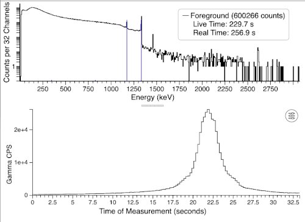

SAND2022-0432 O

# v1.0.9 (Feb 0X, 2021)
InterSpec version 1.0.9 adds a number of user requested features and user reported fixes.
In particular, support volumetric trace sources and cylindrical and rectangular geometries; these are particularly useful for determining contamination levels, or activities of bulk materials.

## Detailed changes for v1.0.9
- Added support for end-on cylindrical, side-on cylindrical, and rectangular shielding/source geometries, in addition to the previously available spherical geometry.  
  - See <a href='../tutorials/contamination/20211117_IAEA_HPGe_InterSpec_SAND2021-14557TR.pdf'>20211117_IAEA_HPGe_InterSpec_SAND2021-14557TR.pdf</a> for the basics of using these new geometries.
  - An example of selecting the shielding geometry:
    
- Add support for volumetric trace sources to the "Shielding/Source Fit" tool.  
  - Trace sources can be any nuclide associated with any of the peaks.
  - Trace sources can be added to any of the material shieldings, and they are source terms only; i.e., adding a trace source to a shielding doesnt affect its attenuation properties.
  - A single shielding can have multiple trace sources, and multiple shieldings may have trace sources.  However, a single nuclide can only be a trace source for a single shielding and a single nuclide cant be a trace source and a point-source or self-attenuating source.
  - Trace sources can be defined in terms of total activity, activity per gram, activity per cm3, or as exponentially distributed surface contamination source where you enter a relaxation distance.
  - A ray-trace algorithm, coupled to an adaptive quadrature based numerical integration scheme is used to calculate attenuation of detected gamma rays, similar to how self-attenuation calculations are performed.
    - Currently, if a shielding with volumetric sources is not the inner-most shielding, the fitting calculations may take significantly longer, but still should be under a minute or so.  This appears to be a result of discontinuities being introduced to the integrand during the adaptive quadrature integration, resulting in many more integration points being needed to insure a sufficient degree of accuracy.  It is likely this can be improved in the future by manually defining integration regions aligning with the expected discontinuities.
  - See <a href='../tutorials/contamination/20211117_IAEA_HPGe_InterSpec_SAND2021-14557TR.pdf'>20211117_IAEA_HPGe_InterSpec_SAND2021-14557TR.pdf</a> for the basics of using volumetric trace sources.
  - An example of adding a trace source to a shielding, and how the trace source display looks, is shown here:
  

    

      
      
To add a trace source, click on the plus button on a material shielding, and select "Add Trace Source".

    

    

      
      
Once the trace source widget is shown, you can select which isotope you would like the trace source to be, and also the style of activity, and if you would like the activity fit or not when you fit the model.

    

  

- Added in accounting for attenuation in air when making a detector response function (DRF).  
  The standard definition for air is used (1.29 mg/cm3).
  
- Added in accounting for attenuation in air in "Activity/Shielding Fit" tool.  
  The standard definition for air is used (1.29 mg/cm3).
  
- Added option to emphasize either gamma or neutron data on time chart.  
  By default gammas and neutrons are scaled to take up the entire y-range, but this can sometimes cause the lines to obstruct the views of each other, or maybe just the gamma or neutron data is relevant to your problem, so this option lets you clearly separate the lines, making the less important smaller.  Note, there is also an option to completely hide the neutron line on the time chart.  

    

        
        
First click on the settings icon on the time chart.

        
In the data shown here you can see the gamma (black line) and neutron (green line) data obscure each other
            which could make it hard to see features of the data in either of the lines.
        

    

    

        
        
Select the &quot;Filter&quot; tab.

        
Here you can see other settings that can be useful for improving the view of the time data.

    

    

        
        
Adjust the &quot;Rel. y-max&quot; value to be between 0.04 and 25.
            Values larger than 1.0 will cause the neutron y-axis range to be that multiple of neutron data range, while
            not effecting the gamma y-axis range. The value of &quot;10.0&quot; shown here causes the neutron y-axis to
            have a range ten times larger than the data, which emphasizes the gamma data.
        

    

    

        
        
Values less than 1.0 cause the gamma y-axis range to be scaled by the inverse of the entered value, while
            not effecting the neutron y-axis range. The value of &quot;0.5&quot; shown here causes the gamma y-axis to
            have twice the range the data calls for, which causes the neutron data to be emphasized.
        

    

- Added support for <em>CALp</em> energy calibration files.  
  <em>CALp</em> files are simple text files that store energy calibration information.  They are particularly useful if you commonly work with data from a detection system that either include no, or poor, energy calibration information with the spectrum data. You can first perform an energy calibration on one spectrum file, save the <em>CALp</em> file, and then sometime later when you are working with a different spectrum file, you can just drag-n-drop the <em>CALp</em> file onto InterSpec, and your previous energy calibration will be used.
  - The <em>CALp</em> file format is defined and used by the excellent [PeakEasy](https://peakeasy.lanl.gov) software.  However, for spectrum files with multiple detectors that have different energy calibrations, PeakEasy collapses them down to a single energy calibration that it presents to the user and saves to <em>CALp</em> files.  While InterSpec presents the user with the original energy calibrations for each of the detectors.  InterSpec also supports adjusting full-range-fraction defined energy calibrations directly, while PeakEasy converts these energy calibrations to polynomial; this conversion is inexact if the fifth full-range-fraction energy calibration coefficient is present.  Because of these potential issues InterSpec extends the <em>CALp</em> format to potentially include multiple energy calibrations (one for each detector) in the file, as well as potentially appending a detector name, or full-range-fraction coefficients after the normal calibration information.  These additions appear to be backwards compatible with PeakEasy.  These extensions are only included when needed, so for the majority of spectrum files (e.g., from systems with single gamma detector) the <em>CALp</em> files from InterSpec exactly follow the format of files from PeakEasy.
  

  
  
The red oval in the lower-left shows the icons that when clicked/tapped will export of import a <em>CALp</em> file.  To apply a <em>CALp</em> file, you can also just drag-n-drop the <em>CALp</em> file from your computers filesystem onto InterSpec.
  

  

- Added support to drag-n-drop a CSV/TSV multiple-detector detector response function (DRF) file onto app.  After dropping the file onto InterSpec a dialog will popup that will let you pick the DRF you want from the file, as well as offer to save the file to InterSpecs internal data so you can use the DRFs later on from the "Rel. Eff." tab of the "Detector Response Function Select" tool (e.g., the dialog that pops up when you click on the detector icon anywhere in the app).  
  The format of the CSV/TSV file is adapted from the LANL SimpleMass spreadsheet, and documentation on its format can be found in the source code comments [here](https://github.com/sandialabs/InterSpec/blob/7ba7703d5a2cf2707f4f6ed791cfefbc81484750/InterSpec/DetectorPeakResponse.h#L362). 

  
  
Example dialog after dropping a CSV/TSV DRF file onto InterSpec.  If selected to 
  

- Added ability to automatically detect and associate single and double escape peaks with a nuclide or reaction energy when you fit for a peak and are showing reference photopeak lines.  An example of this is that often in HPGe spectra, peaks are seen at 2103.5 keV and 1592.5 keV, which are the single and double escape peaks of the 2614.5 keV Th232 line.
    - For lower-resolution detectors this association is only performed if showing the "Escape Peaks" option of the "Feature Markers..." tool, or if above 4 MeV.
    - When there is a full-energy gamma also near the single or double escape peak, which gamma or escape peak line the peak is assigned to is decided using an expected escape peak amplitude for a generic 20% HPGe detector, with an additional (arbitrary) factor of 0.5 applied to prefer assigning to the gamma.  The algorithm to decide on photopeak assignment takes into account energy difference and expected gamma-line amplitude, so it is expected this amplitude estimates should work quite well for most detectors.  An example of this is that the Th232 decay chain has a gamma at 1588.2 keV (from the Ac228 to Th228 decay), which is near the 1592.5 keV double escape peak of the 2614 keV peak; with the chosen amplitude estimates and typical HPGe energy calibration accuracy, the correct assignment was made for both of these peaks when showing Th232 reference lines for a number of detector models tried.
- In the "Make Detector Response" tool, when you click the "Store/Export..." button, an option to also export DRF quick reference card was added. This saves an HTML file with some 3x5 inch sized DRF reference cards that supply the information about the detectors response.  These cards are potentially suitable to attach to a detector for later reference.
- Fixed potential infinite loop in TimeChart JS that could cause the application to stop responding.
- Fixed regression causing the ctrl-drag (e.g., to fit multiple peaks at a time) on the chart to not work.
- Fixed issue where changing the energy calibration could result in an error when only a single spectrum is showing; happened when a previous spectrum had a differently named detector, but otherwise similar data.
- Improved various aspects of peak fitting.
- A number of various display and layout improvements, as well as a number of smaller bug fixes.
- Improved a few spectrum file format parsing, as well as added a few new format variants.

# v1.0.8 (Sep 26, 2021)
InterSpec version 1.0.8 concentrates on improving application usability and bug fixes.

Thank you to all the users who reported bugs or requested features!

## Detailed changes for v1.0.8
- The time-history chart was completely re-written to be more responsive, flexible, display more information, have more options, and be easier to use.  
  This work was primarily carried out by [David Ka-Ming Lee](https://github.com/davidkml) as part of his internship for Sandia National Laboratories.
  - Clicking/tapping the 

icon in the upper-right-hand portion of the time chart will display a widget that allows you to select if you want to zoom in/out, select samples to display the summed spectrum of, and more, as shown in the below animated gif:

  
  
Example of using the time-chart settings widget to navigate the time-series chart, select samples to sum, and set energy range to display the time-chart for.
  

  - If you regularly work with search-mode or radiation portal monitor data that has a time component, you do not need to use the graphical method of selecting the zooming/panning/selecting/etc on the chart - the following shortcuts will allow you to quickly perform all the same operations.
    - <b>Select samples to display spectrum of</b>: For the foreground use the left-mouse button with no modifier keys to select samples.  Pressing the Alt-key (or Option key on macOS) with the left-mouse key will select background samples.  And holding the 's' key while using the mouse buttons will select samples for the secondary spectrum.
    - <b>Adding samples to displayed spectra</b>: Hold the shift-key while dragging with the left mouse button will <em>add</em> samples to the foreground.  Holding the shift-key while pressing the Alt-key (Option-key) or 's'-key will add samples to the background or secondary spectra, respectively.
    - <b>Removing samples from displayed spectra </b>: Hold the control-key while dragging with the left mouse button.  Also holding the Alt/Option/'s'-key will remove samples for background/secondary spectra.
    - <b>Zooming in/out</b>: Use the right-mouse button to zoom in and out.  The zooming in and out is similar to the spectrum chart (click and drag to right to zoom in, and click and drag to the left to zoom-out), just with the right-mouse button.  
      You can also use the mouse up/down wheel (or track-pad equivalent) to zoom in and out.
    - <b>Panning left and right</b>: Click on a x-axis label and drage left/right, or use the mouse left/right wheel (or trackpad equivalent).
      
    These shortcuts are also listed in the filter tool inside the app for a quick reminder.
  - The ability to have the time-chart be displayed for only a specific energy range was also added under the "Filter" tab of the time-chart settings widget.
  

    
Example of displaying the time-chart for only the 1163 keV to 1183 keV (i.e., the lower Co-60 full energy peak
        range) region.
    

  - By default if there are more time-samples in your data than pixels available to display the samples them, multiple time samples will be summed together for display.  This often makes the chart look cleaner and clearer, however, if you are looking for short count-rate spikes, this combining of samples may de-emphasize the elevated regions.  So a "Dont&lsquo;t rebin" option is also available on the "Filter" tab so that each time interval will be plotted.
- Added Flat-step, Linear-step, and Bi-linear-step peak-continuums.
  - After fitting a peak, you can right-click on a peak and go to the "Change Continuum" menu item to select the continuum type you would like.  Or you can use the "Peak Editor" (which can be opened by right-clicking on a peak) to change the continuum type as well.

    

        
Right-clicking on a peak and using the "Change Continuum" menu-item to select the continuum type.

    

    

        
Using the "Peak Editor" to change the continuum type.

    

  - A comparison of the different continuum types is shown below:

  

    
    
Constant

  

  

    
    
Linear

  

  

    
    
Quadratic

  

  

    
    
Flat Step

  

  

    
    
Linear Step

  

  

    
    
Bi-linear Step

  

- Add ability to drag-n-drop a DRF CSV file (made by InterSpec) onto app and use it.
- Fixes and improvements to Activity/Shielding fit tool.
  - Improve fitting of atomic number in the "Activity/Shielding Fit" tool for generic shielding.
  - Fix for possibly using incorrect nuclide Age when nuclides of an element are tied together.
  - The activity uncertainty for self-attenuating sources was not be calculated correctly; has now been corrected.
  - Made the activity and age displayed in center table include uncertainty in same cell
  - Fixed center source table no always being triggered to update wrt other changes
  - Fixed "Fit Mass Fractions" checkbox not always being shown/hidden correctly.
  - Added a link to download a text file summary of the calculation log.
  - Some other small improvements to the tool.
- When using the "Make Detector Response" tool, you can export a CSV of the DRF.  However, previously the uncertainties were not included in this file - they have now been added, and are read back in when you open the CSV file with InterSpec to use it as a DRF.  Uncertainties for the DRF when written into, or read from InterSpec N42 files has also been added.
- Added input for user to specify DRF name when uploading the DRF.
- Made multi-file energy calibration tool more flexible in what it can handle.
- When multiple gammas of the same energy are present, their intensity is now summed for the display of reference photopeak lines on the spectrum chart.  This addressed the relatively uncommon situation where a decay chain has gammas or x-rays from multiple decays paths that have the same energy, and where thus plotted directly on top of each other, making the height of the reference lines appear lower than they should.  Note that the Activity/Shielding fit tool already performed this summing, so fitting for activities, or other areas within the application were not affected by this issue.
- In the energy calibration tab, made it so changing energy calibration doesn't change secondary/background scale factor back to the default live-time normalization (if you had changed the display scale factor).
- Fixed some minor issues with color theme selector window.
- Fixed potential race condition when exporting the various spectrum or CSV files
- Fixed potential crash for search-mode or portal data (e.g., data where the time history chart shows) when the source type was not specified for any of the samples.
- Fixed dose to distance calculation to account for attenuation in air; previously was simply using 1/r2 scaling based on a distance of 10 cm, which didn't account for air attenuation at all. Now iterates to find correct distance that gives desired dose, using the full calculation, including effects of scatter.
- Add example generic NaI 2x2 DRF
- Adding parsing of newer XML format of Detector.dat
- Update version of Electron used
- Updates to spectrum parsing code to improve a few file formats, and add a few more variants
- Added display of use-stats to the "About" window.; added display of total active use time, total number of new sessions, and number of files opened from file system.  This information is not telemetered anywhere; InterSpec does not send information off your computer except when you explicitly use the google maps feature, and then it only sends coordinates to get the maps for to the Google map servers.
- Add polyfill for ResizeObserver, primarily to support slightly older macOS and iOS.
- For Windows and Linux (i.e. Electron builds) sped up loading of spectrum files when dragging and dropping onto app.
- Improve showing app menus on touch.
- Improved indications of file importing/parsing progress for files dropped onto the app.  
- Improved displaying of spectrum file parsing errors
- Improve HPGe peak fitting.
  - Better detect if a spectrum is high resolution, which effects initial peak fitting start parameters.  
    Further work is still needed to more reliably detect high vs medium vs low resolution data when non-standard numbers of channels are used.  Peak fitting issues may arise if you have a low-resolution detector with lots of channels (e.g. a NaI detector with 8k channels), or a high-resolution system with a lower channel count and reduced energy range (e.g., a 20 keV to 150 keV HPGe detector with 4k channels).  For the low-resolution detector case you can use the "Combine Channels..." option on the "Energy Calibration" tab to reduce the number of channels to 4k or less, and avoid the issue. For the high-resolution detector case, you can increase the number of channels to 8k using the "Linearize..." option on the "Energy Calibration" tab.
  - Improve initial estimates of peak fit parameters before doing optimization
  - Improve ROI width
  - Decrease minimum allowed peak widths to allow very high resolution detectors
  - Slightly improve peak width initial estimate if there are nearby peaks to use for it.
- Add a "Simple" info options to "Flux Tool" to display even less information. Numerical formatting in this tool was also improved.
- Improve exporting user-labeled regions of interest to IAEA SPE files.
- For Windows and Linux (i.e., Electron builds), made the title-bar more compact by implementing the menu system in HTML instead of the system menus.  Although this improves the color theming and styling consistency of the app, it is a step towards eventually removing the Electron dependency of building the app on Windows, and instead using the operating system provided WebView, like InterSpec already does on macOS, iOS, and Android.
- A few small improvements for iOS.
- Fix opening files from other apps on iOS.  Was previously trying to access files from outside the apps sandbox before first requesting access.
- Fix flux tool CSV column being off by one when nuclide name contains a comma (e.g., when the "nuclide" was a neutron or alpha reaction).
- Fix native macOS app not saving SVG of spectrum file when requested.
- Fix File Query Tool not searching event XML files on non-Windows devices.
- Fix occasional crash when exiting macOS app.
- Fix issue where some windows within the app wouldn't allow the user to manually resize them smaller than their initial size.
- Update GadrasGamFileParser to partially support more versions of .gam files.
- Improved various display and layout improvements, and fix lots of smaller bugs
- Improved a few spectrum file format parsing, as well as added a few new format variants.

# v1.0.7 (Feb 19, 2021)
InterSpec version 1.0.7 includes a complete revamp of how energy calibration is handled, a number of new features, lots of bug fixes and smaller improvements.

## Detailed changes for v1.0.87
- How energy calibration is handled, both "on the backend" as well as how its presented to the user was completely re-written.
  - How energy calibrations are represented in memory was completely re-written, resulting in better extraction of information from some spectrum file formats, better sharing of calibrations across spectra within a file, further validity checks, speed improvements, and more.
  - The previous deviation pair implementation had a significant number of issues that have now been corrected.  
  - Despite the N42-2006 and N42-2012 standards containing support for deviation pairs, no publicly available documentation appeared to be available to describe their use or implementation.  To help correct this the [SpecUtils](https://github.com/sandialabs/SpecUtils) deviation pair implementation was documented throughout the code, based on correspondence with the authors of GADRAS-DRF, and by validating against other software and spectrum files. For an example of some of the documenation, see [here](https://github.com/sandialabs/SpecUtils/blob/ded0e54c676df7bfa555e9032c9533c910cc599e/SpecUtils/EnergyCalibration.h#L363)).
  - The "Energy Calibration" tool/tab was completely rewritten to provide more flexibility and functionality.  An example of how this tool now looks for a spectrum file with multiple detectors, with both a foreground and background file loaded, is:
    - Previously when parsing a spectrum file that contained multiple detectors with different energy calibrations (most common in radiation portal monitors or search systems), the data would be re-binned to a single energy calibration.  This made things simple both from an implementation and use point of view, but made changing energy calibration of the detectors relative to the other detectors a pain.  
      In the above screenshot you can see that you can now click each detectors name to display and edit the energy calibration for that specific detector.  There is also a "Apply To" column that lets you select how you want your changes applied.  If you change the calibration of one detector, the <em>difference</em> for the other detectors calibrations is calculated, and the change applied to them as well (i.e., the amount peaks shift will be the same for detector that you edited the calibration for, as well as all the other detectors).  Note that if you, for example, change the gain of one detector by 0.1, the other detectors gain (as well as other terms) may change by different amounts if there are higher order terms; InterSpec does the math so that the effects across the energy range for each of the detectors is the same (e.g., the behavior is how you would niavely expect).  
      If you do not want a change to be applied to all the detectors, you can make some detectors not visible using the <b>View</b> &rarr; <b>Detectors</b> menu option, which will trigger the "Apply Changes" column to also have an option to apply the change just to the visible detector(s), or all the detectors.
    - A "Linearize..." option was added.  This option will re-bin the spectra so that each channel has the same energy-width.  It also lets you change (both decrease and increase) the number of channels of the data. This linearize ability comes in handy especially when you want to re-energy-calibrate the data, but the original energy calibration is not polynomial or full-range-fraction, or the energy binning is very non-linear, or you want to remove having deviation pairs.  The total number of counts in the spectrum will remain the same before and after the linearization.
    - A "Truncate Energy..." option was added to allow keeping only a sub-range of data.  This option can be useful if you wish to remove irrelevant portions of the spectrum before exporting to use in other tools.
    - A "Combine Channels..." option was added to combine neighboring channels.  Most useful when the original spectrum contains more channels than needed for its intrinsic energy resolution.
    - A "To FRF..." or "To Polynomial..." option was added to allow converting the energy calibration between polynomial and full-range-fraction; some people find one of calibrations more intuitive than the other.  This option can also convert from energy calibration given by lower channel energies to polynomial calibration, but if the underlying binning is not consistent with a polynomial, results will not be great (use the "Linearize..." option for these cases).
    - The "Multi File Cal..." capability was slightly improved; this tool is useful especially for low-resolution systems where you might take a separate spectrum of multiple sources (e.g., a low energy source, a high energy source, etc), and then use these multiple spectra to perform an energy calibration.
- Added a "Hard Background Sub..." option under the <b>View</b> menu.  
This performs a "hard" background subtraction that is a channel-by-channel subtraction of the background spectrum from the foreground spectrum.  When this is done a new spectrum file is created with the resulting spectrum as its only spectrum.  That is, after a hard background subtract, the "Spectrum Files" tab will show a new file listed with its name being the old foreground spectrum file name, prepended with "bkgsub_", and its only sample being the subtracted spectrum.  
A few points worth noting: 
  - The other, and previously only, background subtraction option is a display-only setting that doesn't affect the underlying data (e.g., peaks are fit to the original, not subtracted data).  This is why sometimes there are artifacts on peak-continuums in this mode.
  - Peaks fit after a "hard" background subtraction will use the new channel counts as the data variances, which is not correct, but also usually doesn't cause any notable issues.
  - Small energy calibration discrepancies between the foreground and background can create artificial features in the resulting spectrum.
  - If a peak in the foreground overlaps with a peak in the background, then the statistical uncertainty of the fit peak will no longer be correct (likely underestimated) when fitting for activity.
  - When you perform the "hard" background subtraction, you will be given the option of truncating negative counts (i.e., channels where background has more counts than foreground) to zero, as well as the option to round channel counts to the nearest integer number of counts.
    - Even if both the foreground and background spectra only have integer channel counts, if the integer rounding option isnt selected, you may end up with non-integer counts if the energy calibration is different in the foreground and background
- When loading a file that contains RIID analysis result, a popup message is now displayed with a summary of the result, and a link to see the full RIID analysis results.  The full results are also available using the "Show RIID Results" menu item in the "View" menu.  The formatting and display of the RIID results was re-written.
- Implement so alt-drag (cntrl-drag on macOS) fits peak(s) in real time as you drag.
- Improve multi-file uploads when the files have names that indicate foreground/background/secondary.  
If file names indicate that they are for item of interest, background, or known sources, then you can drag-n-drop multiple files onto InterSpec at the same time and have them all opened up correctly.  
Spectrum type indications recognized by InterSpec are:
  - <b>Foreground</b>: file name starts with 'i-' or has the strings 'fore', 'item', 'ipc', 'unk', or 'inter' anywhere in them.
  - <b>Background</b>: file name starts with 'b-' or has the strings 'back', 'bkg', 'bgd', or 'bg' anywhere in them.
  - <b>Secondary</b>:  file name starts with 'k-' or has the strings 'known', 'kwn', 'cal', or 'check' anywhere in them.
- Added a new tool, the "Math/Command Terminal" (from the "Tools" menu).  This tool allows you to perform numerical calculations, or perform actions on the currently displayed spectrum.  For example, to fit the Cs137 peak you could type `searchPeak(661)`, then to get its area `peakArea(661)`, or you could do something like `x = peakArea(1460) / peakArea(2614)` and later on `x/0.19`. This tool was written by @kenmorte a number of years ago, but hadnt made it into the released application pending a few minor fixes and testing; it is still a beta-quality tool, and its API for interacting with the spectrum is expected to evolve over the next few releases to meet the needs of users.
- Re-wrote the decay chain visualization in the "Nuclide Decay Info" tool to be more interactive, contain more information (e.x., specific activity of nuclides), and to have a better layout.  The tool also now provides an option that can be clicked to see what nuclides will decay through a given nuclide; this is useful, for example, if you are seeing a number of gamma lines from a short-lived isotope, like Tl208, and want to know the possible parent isotopes that have this short-lived isotope in their decay chain.
- Move the "Detector" menu in the "View" chart to be second item in menu, rather than further down.
- Fix issue loading portal/search as foreground, when all samples were marked as background.
- Improve numerical accuracy of DRF calc at larger distances; before with smaller detectors could run into issues starting at distances around 12m; now DRFs should be good to over 200 km.
- Added links to help on the tools tabs
- Changed a number of message dialogs to use a simplified and clearer dialog window.
- Added exporting the spectrum chart as PNG or SVG images
- Added support for "derived-data" in N42 files.  
Derived data in N42 files are usually the spectra used by the detector itself to perform its RIID analysis.  For example a derived data spectrum may be the sum of many other spectra in the file, or the energy calibration may be different than the data elsewhere in the file, or so on.  The N42 specification doesn't fully enumerate how to specify what the derived spectra s, so each detection system will typically indicate this in non-standard ways; while parsing the files InterSpec will attempt to decipher what the derived spectra represent, but only for the detection systems available to the developer of InterSpec, or that happen to use similar notations.  If you encounter a detection system InterSpec doesn't decipher correctly, please email a representative spectrum file to <a href="mailto:interspec@sandia.gov" target="_blank">interspec@sandia.gov</a> for possible fixing.
- Updated the nuclide decay database.  A couple minor issues were fixed in the decay code, that likely never affected users.
- Improvements to the decay calculator to be a little more user-friendly to use.
- In the "Activity/Shielding Fit" tool, removed checkbox next to peaks that didnt have associated nuclide, or escape peaks.
- Added some additional checking in the "Activity/Shielding Fit" tool so that some options are now not shown when not relevant.  For example the option to fit a nuclides age wont be shown if the nuclides spectrum doesn't appreciably change with age.  For some options, some erroneous cases may still occasionally make it through when they aren't applicable; these cases can be identified by errors when the model is fit for, or very large uncertainties on fit values.
- Added "CPS" (counts per second) column into the "Peak Manager" tab; removed continuum area, and replaced it with ROI (region of interest) counts, which is more meaningful.
- Added "CPS" info into mouse-over info box on spectrum, and a few other places.
- Added allowing to use InterSpec from your internet browser.  
From the "View" menu select "Use in external browser" to open up an instance of InterSpec in your default browser.  You can also find the URL to access InterSpec from the "data" section of the "About InterSpec" dialog.  
This web-version of InterSpec can only be accessed on your computer (the server is bound to 127.0.0.1, which your OS enforces as only available on your local computer), and only while the main InterSpec application is running.  Each time the main InterSpec application is restarted, a different random port will be used to serve the web-page on.  This mode of using InterSpec should allow a nearly unlimited number of application tabs to be used concurrently with minimal memory overhead.
- Added export of TKA format spectrum files.
- Added exporting of CNF files.
- Removed showing reference lines for X-rays or gammas bellow 10 keV, because the x-ray data for nuclides is cut off bellow 10 keV, so this makes things more consistent.
- Changed tool tips to be disabled or delayed on default, instead of instant.  This option can be changed with the "Help" &rarr; "Options" &rarr; "Show Tooltips" setting.
- Added a new keyboard shortcut, Ctrl-C, that clears all showing reference lines.
- Added a preference so that activity can be displayed in various places throughout the app in either becquerel or curie units. See the "Help" &rarr; "Options" &rarr; "Display in Becquerel" option to set this.
- Added in a tab to the Welcome window that provides the keyboard shortcuts that are available in the application.
- Added Ctrl-L shortcut to toggle log/linear spectrum chart y-axis.
- Added "Clear Session" menu item to "InterSpec" menu.  When triggered, this option resets the application state to an empty state with no files loaded, or tools open.
- Added "Activity/Shielding Fit" testing to the end-to-end testing mechanism, and fixed a few issues within this testing.
- When a foreground and background and/or secondary spectrum is loaded, the "View" &rarr; "Show Energy Slider" option shows little bars to the right of the spectrum chart where you can manually scale the spectra (by default they are live-time normalized when spectra are loaded); the display of these slider bars was changed to defaulting to visible, but the option under the "View" menu can still be used to hide the sliders.
- Renamed the "Activity Converter" tool to "Units Converter" and added in the capability to convert between a number more relevant units.
- Added ability to edit the name and description of application states saved to InterSpecs internal database.
- Added a "Peak Add" dialog to add difficult-to-fit peaks.  This is available from the "Peak Manager" tab by clicking the "Add..." button.
- Fixed issue where betas where not separated by commas on the CSV output of decay tool.
- Fixed some time-history chart display issues; however we have a complete re-write of the time history chart expected out in the next release.
- Fixed issue where the "InterSpec" &rarr; "Manager..." tool wouldn't always update the "sum" option on spectrum or scale factor changes.
- Fixed issue with re-fitting peaks in a region of interested, where the peaks all had fixed energy/widths.
- Fixed issue where neutron counts shown for the background/secondary spectrum in the legend were scaled according to the gamma live-time relative to the foreground.  Now just show the neutron in counts per second (CPS).
- Fixed determining correct background/secondary sample numbers to use when loading app state.
- Fixed bug where the "Flux Tool" was displaying flux per mm2 instead of the claimed cm2; now reports in cm2, as it is labeled.  
- Fixed issue in the "Energy Range Sum" tool where an incorrectly calculated uncertainty was being used to calculate the number of sigma the foreground was off from the background or secondary spectra.
- Fixed invalid runtime check in the "Dose Calc" tool that was accidentally left in, and would prevent the tool from being able to be used.
- Fixed issue where the wrong energy for the deviation pair would be used, when the deviation pair was added by Ctrl+Option+Drag.
- Fixed issue where when loading a new spectrum, and the user selected to propagate peaks from the previous spectrum to the new one, the continuums of the previous peak could be modified during the fit of peaks of the new spectrum. 
- Fixed "Activity/Shielding Fit" calculation log not including uncertainties.
- Fixed issue triggered when removing the background spectrum, but the foreground was (non-"hard") background-subtracted.
- Fixed issue with shielding/source fit related to age. When nuclide ages for an element were selected to have the same age, there were significant issues when some of the nuclides for an element were not candidates for aging (i.e., their gamma spectra dont change with age).
- Fixed issues with the spectrum chart on touch-screen computers where if you used both mouse and touch interactions the chart would start behaving poorly.  Touch interactions dont yet have feature-parity with mouse-interactions, but most common operations are supported (zooming, panning, double-tapping, holding down for a second to right-click, deleteing peaks, etc).
- Fixed some issues with using Electron Native menus for Windows and Linux builds.
- Fixed a number of bugs that could lead to application crashing, inconsistent state, or undefined behavior.
- Fixed issue in "Make Detector Response" tool that changing a shielding didn't cause an update of the efficiency curve
- Fixed issue where background scale factor wasn't propagated to chart properly.
- Fixed issue where app could freeze when showing peak labels, as well as improved some other peak label aspects such as position and interactivity
- Fixed integer overflow of time period calculation of the "Calculator" tab of the "Nuclide Decay Information" tool.
- Fixed issue removing background when secondary was also showing.
- Fixed user peak-label getting lost when adding peak to ROI.
- Fixed showing ref lines for nuclide search by energy when tool tabs aren't showing (e.g., you selected the "View" &rarr; "Hide Tool Tabs" option).
- Fixed some display issues with "Activity/Shielding Fit" tool.
- Fixed some undefined behaviors and minor memory leaks
- Fixed calling some obj-c selectors not available in macOS 10.10.  Note that InterSpec is not tested on versions of macOS not currently supported by Apple (10.13 as of this release), but it may still work on older versions of macOS.
- Fixed the "Make Detector Response" tools charting to obeying color theming.
- Improved some spectrum chart rendering aspects
- Increased peak-fitting speed by about a factor of three, and also improved the speed of various other calculations throughout the app.
- Move some of the chart options from the "Chart Options" submenu to regular "View" menu.
- Make so reference photo peak lines won't display shielding information when shielding thickness is essentially 0.
- On the "Nuclide Search" tab, the cursors focus is now set to the new energy input a new energy is added.
- Moved a number of floating point number inputs (e.g., spin-boxes) throughout the application, to use more native number entry.
- Some improvements in "dark mode" displays.
- Added support for compiling the code, or running the application on Ubuntu 14 (i.e., gcc 4.8.3), however, support for compiling the code on old Linux distributions will likely be removed at some point in the future to allow use of more modern C++.
- Added some additional unit tests and developer checks.
- Turned operating-system provided autocomplete off for a number of input fields, as it usually isnt helpful.
- The gamma cross-section calculation [code](https://github.com/sandialabs/InterSpec/blob/master/InterSpec/MassAttenuationTool.h) artificially limited the energy range of some processes; this was corrected so calculations can be performed from about 1 keV to about 100 MeV.
  - Note though that InterSpec x-ray and gamma data below 10 keV has in most cases been removed as it is not relevant for most spectrometers.
- Improvements to the development-only test suite tool.  This tool allows replaying the analysis performed on a spectrum, and ensures answers received (peaks that could be fit, activities and shieldings fit, etc) are within allowed accuracies.
- Removed server access messages (e.g., every GET or PUT request being output to stdout), not normally seen by user, but cluttered up OS logging
- Added support for making a dynamic InterSpec library to allow integrating InterSpec into other applications more easily.  Integration into other applications from languages that support C-linkage (Python, node.js, etc), can be pretty easy; see the [target/sharedlib](https://github.com/sandialabs/InterSpec/tree/master/target/sharedlib) directory for an example of running InterSpec from Python and loading a specific file.  Only minimal amount of functionality has been implemented, but further functionality is likely straightforward; email <a href="mailto:interspec@sandia.gov" target="_blank">interspec@sandia.gov</a> for more information or more functionality.
- Improve various display and layout improvements, and fix lots of smaller bugs
- Lots of code quality and minor improvements

## v1.0.6 (November 4, 2019)
This release is mostly stability improvements, small UX improvements, and bug fixes.
Download Windows, Linux, and macOS binaries from: [https://github.com/sandialabs/InterSpec/releases/tag/v1.0.6](https://github.com/sandialabs/InterSpec/releases/tag/v1.0.6)

* Improvements and fixes:
- For Windows and Linux made running application more robust by compiling the InterSpec C++ code to a node.js module, rather than a separate executable that had to be run by, and communicate with node.js.  
  - Updated to using [Electron](https://electronjs.org/) v7.0.1.
- Fixed a few potential JS issues when starting up that could prevent app from fully loading.
- Added checking for a file 'do_restore' in the applications OS-provided data directory; if it exists, it will be deleted, and `InterSpec` will try to load were you left off in your last session.  When the app successfully fully loads, the file will be written again.  If the file doesnt exist when the application is started, the previous app state will not be restored.
- On the "Peak Manager" tab you can export the currently fit peaks as a CSV file.  Now, if you open up a different spectrum file, you can drag the previously exported CSV file onto the app, and the peaks defined in that file will be fit for.  Additionally there is a new options (Help -> Options-> Ask to Propagate Peaks) you can enable so that when you load a new spectrum from the same detector as your current one, peaks will be propagated (and re-fit) from the old spectrum to the new one.  In both cases a dialog showing the newly fit peaks will be presented to the user so they can select which peaks to keep.  These feature are useful if you frequently deal with spectra from the same detector with similar isotopes.
- Made it so if you assign a nuclide to an existing peak, and other peaks have already been assigned that nuclide and they are all the same color, the new peak will be assigned their color.
- Improved suggesting peak assignments for single and double escape peaks from the right-click "Change Nuclide" sub-menu.  Further improvements are expected in the future.
- Fix potential issue if google maps widget was shown more than once in a session.
- Fix a few issues assigning x-rays or reactions to peaks.
- Increase peak label sizes.
- Added a "Feature Marker" widget that allows easier, and more complete, selecting to show escape peak lines, Compton Edge, Compton Scatter and sum-peaks.
- Fix a few more instances of trouble loading files when there name/path contained some non-ASCII characters.
- Many smaller fixes and improvements.
- Added some less-common spectrum file formats and N42 variants.

## v1.0.5 (August 23, 2019)
This release is mostly small bug fixes, improvements, and the addition of the **Flux Tool**.
Download Windows, Linux, and macOS binaries from: [https://github.com/sandialabs/InterSpec/releases/tag/v1.0.5](https://github.com/sandialabs/InterSpec/releases/tag/v1.0.5)

* Bug Fixes and improvements:
  - A concurrency issue that could lead to the **File Query Tool** rarely missing results for Windows/Linux was fixed.
  - Fixed issue in Windows, where when opening a spectrum file by dragging it to the `InterSpec` icon in Windows Explorer, the file wouldnt always be opened 
  - The macOS version of InterSpec is now [sandboxed](https://developer.apple.com/app-sandboxing/), has the [hardened runtime](https://developer.apple.com/documentation/security/hardened_runtime_entitlements?language=objc) enabled, and [notarized](https://developer.apple.com/documentation/security/notarizing_your_app_before_distribution?language=objc) by Apple.  Mac users, please see [these instructions](v1.0.5/macOS_upgrade_notes) for upgrade notes.
  - Some small improvements to plotting the spectra, including the background spectrum line is now plotted behind the foreground spectrum line.
  - Fixes and improvement to the detector efficiency CSV that can be optionally be exported when saving a detector response function after fitting to data.
  - Fixed some potential issues when entering a arbitrary DRF efficiency equation; equation parsing should now be much more robust and general.
  - Other small fixes and improvements.

* Feature addition:
  - Added a **Flux Tool** that helps you to compute the number of gammas at a given energy produced by a source.  For more information see [flux_tool_help.pdf](v1.0.5/flux_tool_help.pdf) (document also available inside `InterSpec`s built in help system). 
  

## v1.0.4 (July 21, 2019)
This release primarily improves the interactivity with the spectrum.
Download Windows, Linux, and macOS binaries from: [https://github.com/sandialabs/InterSpec/releases/tag/v1.0.4](https://github.com/sandialabs/InterSpec/releases/tag/v1.0.4)

* Bug fixes:
  * InterSpec would not start for Windows users with some non-English characters (ex, an umlaut) in their user names.  Paths with these letters also affected the file query tool, or if the open file menu item was used to open spectrum file.
  * The "Add Peak" option when a Region of Interest (ROI) is right clicked had issue resulting in peaks not actually being added
  * Windows and Linux version of app could sometimes get duplicate menu items

* New Features:
  * Based on the awesome work by [Christian Morte](https://github.com/kenmorte) of using [D3.js](https://d3js.org/) to plot spectrum files, the plotting and interacting with spectra has been completely re-written, and made substantially better.  See below videos for an overview of how to interact with the spectrum.
    * This new charting mechanism will make it easier to implement richer, more interactive features in the future.
    * On touch-devices, some touch interactions are working, but there is no timeline for when the rest will be implemented, so for now phone and tablet versions of the app will use the old charting mechanism
    * There are significant additional performance improvements and user experience improvements possible, but there is no timeline for this work
  * Added some example problems and solutions available at [https://sandialabs.github.io/InterSpec/tutorials/](https://sandialabs.github.io/InterSpec/tutorials/)
  * Added a few new file formats (TKA, MultiAct), and some new N42 format variants
  * A number of smaller bug fixes and improvements

### Interactions with the spectra:
  All these videos are also available within `InterSpec` by going to the **Help** &rarr; **Welcome...** menu item, and then selecting the **Controls** tab.

  * Zoom In and Zoom Out
    
    * Left-click and drag to the right to zoom in, and left-click and drag to the left to zoom out (same as before).
    * Or use the energy slider chart (see below)

  * Drag The Spectrum Left and Right
    
    * Use the right mouse button to grab and drag the spectrum left and right.
    * You can also use the vertical scroll-wheel (if your mouse or trackpad supports this) to move the chart left and right.
    * You can also "grab" the x-axis using the left mouse button to drag it left and right.
    * Or use the energy slider chart (see below)

  * _**New**_ Energy Slider Chart:
    
    * Select the **View** &rarr; **Chart Options** &rarr; **Show Energy Slider** menu item to enable the slider chart.  Whether this chart is shown or not is remembered by `InterSpec` in future sessions.

  * _**New**_ Graphically Scale Background and Secondary Spectra
    
    * Select the **View** &rarr; **Chart Options** &rarr; **Show Y-Axis Scalers** menu option to enable the scalers on the right side of the chart.  Scalers are only shown for the background and secondary spectra, and only when they are plotted (eg, if you are only displaying a foreground spectrum, no sliders will be shown).  The **Spectrum Files** tab has a button to re-Live-Time normalize the spectra (which `InterSpec` does by default) if you wish.  Whether these scalers are shown or not is remembered by `InterSpec` in future sessions.

  * _**New**_ Graphically Adjust Peak Fit Range
    
    * Move your mouse to within 10 pixels of the edge of a ROI, and the cursor will change indicating you can left-click and drag the ROI edge to where you would like.  Your mouse must also be approximately within the Y-axis range of the peak as well (this is so when you have HPGe spectra with many peaks, you wont accidentally grab a ROI edge when zooming in and out).
    * Dragging one side of a ROI past the other side of a ROI will delete the ROI.
    * You can also adjust the ROI range (and everything else about the peak) using the **Peak Editor** that can be gotten to by right-clicking on a peak

  * Fitting for Peaks
    
    * Same as before.  The easiest way to fit a peak is to just double click in the vicinity of the peak region.  If you want to add another peak nearby, just double click again.  You can also right-click on a peak and select to add a peak in the same region of interest (ROI).

  * Fit for Multiple Peaks in a ROI at Once
    
    * <kbd>CTRL</kbd> + Left-Click-and-Drag.  When you release the mouse a menu will pop up and allow you to select how many peaks you would like in the ROI.

  * _**New**_ Adjust Axis Ranges by Dragging On Axis
    
    * You can change the axis ranges by clicking and dragging the ticks.
    * The y-axis also responds to the mouse wheel, which lets you adjust the padding both on the top, and the bottom of the y-axis

  * _**Improved**_  Graphical Energy Calibration
    
    * <kbd>CTRL</kbd> + <kbd>ALT</kbd> + Left-Click-Drag
      * If you do this twice in a row, like first on a low energy peak, then a high energy peak (or vice versa), the dialog that pops up will have an option that will make it so both of your calibrations points will be preserved by adjusting both the gain and offset.

  * See the **Controls** tab of the **Welcome** screen in `InterSpec` for more.